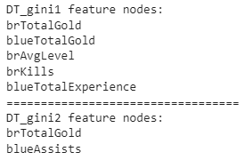

# 实验一报告

## 一. 实验目的

* 本实验以英雄联盟对局胜负预测任务为基础，要求实现决策树算法相关细节， 加深对算法的理解，并了解做机器学习任务的大致流程。

* 要求通过特征预测标签。

  

## 二. 特征提取

传统的机器学习模型大部分都是基于特征的，因此特征工程是机器学习中非常重要的一步。

### 2.1 特征概览和分析

* 原数据集来自[Kaggle](https://www.kaggle.com/bobbyscience/league-of-legends-diamond-ranked-games-10-min)，包含了**9879**场**钻一到大师段位**的单双排对局，对局双方**几乎是同一水平**。每条数据是前10分钟的对局情况，每支队伍有**19**个特征，红蓝双方共**38**个特征。这些特征包括英雄击杀、死亡，金钱、经验、等级情况等等。（一局游戏一般会持续30至40分钟，但是实际前10分钟的局面很大程度上影响了之后胜负的走向）

* 查看原始数据(这里仅列出一部分)

  

  ​						*橘色表示label=0的数据分布情况，蓝色表示label=1的数据分布情况 (originaldata.png)*

  其中不难看出，有写特征会导致label=0和label=1的分布相差很大而一些则相差很小。而相差很小的那些特征就是可能存在的冗余， 因此需要去除它们。

### 2.2 增删特征

1. 有时构造一个好的特征比改进一个模型带来的提升更大。
2. 有时特征列中的某些特征信息是完全冗余的，会给模型带来不必要的计算量，可以去除。

* 以下特征是案例里已经删除了的特征

  ```python
  ['blueGoldDiff', 'redGoldDiff', 'blueExperienceDiff', 'redExperienceDiff', 'blueCSPerMin', 'redCSPerMin', 'blueGoldPerMin', 'redGoldPerMin']
  ```

  相比于红蓝双方击杀、助攻的绝对值，可能双方击杀英雄的差值更能体现出当前对战的局势。因此，我们可以构造红蓝双方对应特征的差值。在案例中事先添加了这些新特征。

  ```python
  ['brWardsPlaced', 'brWardsDestroyed', 'brFirstBlood', 'brKills',  'brDeaths', 'brAssists', 'brEliteMonsters', 'brDragons', 'brHeralds', 'brTowersDestroyed', 'brTotalGold', 'brAvgLevel', 'brTotalExperience', 'brTotalMinionsKilled', 'brTotalJungleMinionsKilled']
  ```

* 以下特征是经过观察后又删除的特征

  ```python
  ['blueWardsPlaced', 'blueWardsDestroyed', 'blueTotalJungleMinionsKilled', 'redWardsPlaced', 'redWardsDestroyed', 'redTotalJungleMinionsKilled', 'brWardsPlaced', 'brWardsDestroyed', 'brTotalJungleMinionsKilled']
  ```

* 剩余特征共34个(*beforebinning.png*)

  

### 2.3 特征离散化

决策树ID3算法一般是基于离散特征的，本例中存在很多连续的数值特征，例如队伍金币。直接应用该算法每个值当作一个该特征的一个取值可能造成严重的过拟合，因此需要对特征进行离散化，即将一定范围内的值映射成一个值，例如对用户年龄特征。

* 经过先前的观察，不难发现其中一部分特征的取值范围较小， 因此不做离散处理

* 离散方法1. 去掉两端1%的极值后，等区间划分

* 离散方法2. 去掉两端1%的极值后，等频率划分

  ```python
  # quantize each feature
  def binning(df, numOfBins, method):
    discrete_df = df.copy()
  
    for c in df.columns[1:]:
      # skip the some features
      if c == 'blueEliteMonsters' or c == 'blueDragons' or c == 'blueHeralds' or c == 'blueTowersDestroyed': continue
      if c == 'redEliteMonsters' or c == 'redDragons' or c == 'redHeralds' or c == 'redTowersDestroyed': continue
      if c ==  'brFirstBlood' or c == 'brEliteMonsters' or c == 'brDragons' or c == 'brHeralds' or c == 'brTowersDestroyed': continue
  
      # method 1. trim off the extreme values and cut the range into equal width
      if method == 'equalwidth':
        win = df.loc[df['blueWins'] == 1][c].tolist()
        lose = df.loc[df['blueWins'] == 0][c].tolist()
        win.sort()
        lose.sort()
        lower = win[int(0.01*len(win))]
        upper = lose[int(0.99*len(lose))]
        step = int((upper - lower)*1000/numOfBins)
        bins = [-np.inf] + [i/1000 for i in list(range(int(lower*1000), int(upper*1000), step))] + [upper, np.inf]
        discrete_df[c] = pd.cut(discrete_df[c], bins, labels = False)
  
      # method 2 equal frequency
      if method == 'equalfrequency':
        l = df[c].tolist()
        l.sort()
        lower = l[int(0.01*len(l))]
        upper = l[int(0.99*len(l))]
        bins = [-np.inf, lower, upper, np.inf]
        for i in range(1, numOfBins):
          edge = l[int((i/numOfBins)*len(l))]
          bins.append(edge)
        bins = list(set(bins))
        bins.sort()
        discrete_df[c] = pd.cut(discrete_df[c], bins, labels = False)
  
    return discrete_df
  ```

### 2.4 离散效果

这里使用了7个区间

* 使用等区间划分(*afterbinning_equalwitdth.png*)

  

* 使用等频率划分(*afterbinning_equalfrequency.png*)

  

> 1. **等区间：还是原来的distribution**
> 2. **等频率：将 original distribution transform to uniform distribution，regardless of the shape of the original distribution**
> 3. **在一些情况下, 等频是没有必要的，例如 当数据集的大量数据集中在[4.9,5.1)之间时，等频划分可能会继续将这个区间细分成几份，但对信息增益是不起任何作用的，而等区间可能就把它是为一体了**
> 4. **至于到底选哪一种方案，还要看对信息增益的效果如何**

做一个猜想(后面验证): 等频划分的效果会比等区间划分的效果好，因为可以从上图比较出，对于同一个特征，等频划分可以将数据对label=0和label=1的分布情况“分得更干净”

### 2.5 数据集准备

构建机器学习模型前要构建训练和测试的数据集。在本例中首先需要分开标签和特征，标签是不能作为模型的输入特征的，就好比作业和试卷答案不能在做题和考试前就告诉学生。测试一个模型在一个任务上的效果至少需要训练集和测试集，训练集用来训练模型的参数，好比学生做作业获得知识，测试集用来测试模型效果，好比期末考试考察学生学习情况。测试集的样本不应该出现在训练集中，否则会造成模型效果估计偏高，好比考试时出的题如果是作业题中出现过的，会造成考试分数不能准确衡量学生的学习情况，估计值偏高。划分训练集和测试集有多种方法，下面首先介绍的是随机取一部分如20%作测试集，剩下作训练集。sklearn提供了相关工具函数`train_test_split`。sklearn的输入输出一般为numpy的array矩阵，需要先将pandas的DataFrame取出为numpy的array矩阵。

```python
all_y = discrete_df['blueWins'].values # 所有标签数据
feature_names = discrete_df.columns[1:] # 所有特征的名称
all_x = discrete_df[feature_names].values # 所有原始特征值，pandas的DataFrame.values取出为numpy的array矩阵

# 划分训练集和测试集
x_train, x_test, y_train, y_test = train_test_split(all_x, all_y, test_size=0.2, random_state=RANDOM_SEED)
all_y.shape, all_x.shape, x_train.shape, x_test.shape, y_train.shape, y_test.shape # 输出数据行列信息
```


## 三. 建立模型

### 3.1 建立决策树模型

* 树的基本数据结构是由`Node class`递归建立的。

  一个`Node` 可以是`feature node`，`branch node`，或`leaf node`

  `Node class`中存有三个成员变量：

  1. `self.value`：如果是`feature node`，则存`feature name`。

     ​					   如果是`branch node`或`leaf node`，则存相关取值。

  2. `self.next`：如果是`feature node`或`leaf node`，则为`None`。

     ​					  如果是`branch node`，则它指向的下一个`node`

  3. `self.childs`：如果是`feature node`，则存`branch nodes`。

     ​						 如果是`branch node`或`leaf node`，则为`None`。

* 对外提供的是`fit()`函数和`predict()`函数。

* `fit()`内部调用`_expend_node()`在训练时构造决策树，`predict()` 内部调用 `_traverse_node()` 在预测时递归寻找每一层的答案

* `_expand_node()`的主要情况：

  1. 需分裂 或 达到分裂阈值

  2. 调用gain()找到最佳分裂特征，递归调用expand_node

  3. 找不到有用的分裂特征

* `_traverse_node()`的主要情况：

  1. 已经到达叶节点，则返回分类结果

  2. 该特征取值在训练集中未出现过

  3. 依据特征取值进入相应子节点，递归调用traverse_node

```python
# Decision Tree Classifier Model
import math

class Node(object):
  def __init__(self):
    self.value = None
    self.next = None
    self.childs = None

class DecisionTree(object):
  def __init__(self, categories, feature_names, max_depth = 10, min_samples_split=10, impurity_t = 'entropy'):
    self.categories = categories 
    self.feature_names = feature_names.tolist()
    self.max_depth = max_depth
    self.min_samples_split = min_samples_split
    self.impurity_t = impurity_t
    self.root = None
 
  def fit(self, X, y):
    assert len(self.feature_names) == len(X[0])
    # assign an unique number to each instance
    x_ids = [i for i in range(len(X))]
    # assign an unique number to each feature
    feature_ids = [i for i in range(len(self.feature_names))]
    # init root node
    self.root = self._expand_node(x_ids, feature_ids, X, y, self.root)
    

  def predict(self, X):
    assert len(X.shape) == 1 or len(X.shape) == 2

    # only one sample is given
    if len(X.shape) == 1: 
      feature_ids = [feature_id for feature_id in X]
      return self._traverse_node(X, self.root)

    # predict a group of samples
    if len(X.shape) == 2:
      n, m = X.shape
      feature_ids = [feature_id for feature_id in X[0]]
      return [ self._traverse_node(X[i], self.root) for i in range(n)]
```

* `_expand_node()` 的具体代码实现

  ```python
  # for building the model
  def _expand_node(self, x_ids, feature_ids, X, y, node):
      feature_ids = list(feature_ids)
  
      # init a node
      if not node:
        node = Node()
  
      # sort label values by instance id
      labels_in_features = [y[i] for i in x_ids]
  
      # if exceeds the threshold values, return mode(y)
      if (len(self.feature_names) - len(feature_ids) > self.max_depth) or (len(x_ids) <= self.min_samples_split):
        node.value = max(set(labels_in_features), key = labels_in_features.count)
        return node
    
      # if all the sample have the same y values, return mode(y)
      if self._all_equal(labels_in_features):
        node.value = labels_in_features[0]
        return node  
  
  
      # if all input features are the same
      if self._all_equal(X.tolist()):
        node.value = max(set(labels_in_features), key = labels_in_features.count)
        return node
      
      # if there are not more feature to compute, return mode(y)
      if len(feature_ids) == 0:
        node.value = max(set(labels_in_features), key=labels_in_features.count)  # compute mode
        return node
  
      # choose the feature that maximizes the information gain
      best_feature_name, best_feature_id = self._get_feature_max_information_gain(x_ids, feature_ids, X, y, 0.01)
      # prepruning - if the max information gain is less than 0.01
      if not best_feature_name and not best_feature_id:
        node.value = max(set(labels_in_features), key=labels_in_features.count)
        return node
      node.value = best_feature_name
      # print( 'depth {} : {}'.format(len(self.feature_names) - len(feature_ids), node.value))
      node.childs = []
      # unique value of the chosen feature for each instance
      feature_values = list(set(X[:, best_feature_id]))
      # loop through all the values
      for value in feature_values:
        child = Node()
        child.value = value 
        node.childs.append(child)
        child_x_ids = [i for i in x_ids if X[i][best_feature_id] == value]
        if not child_x_ids:
          child.next = Node()
          child.next.value = max(set(labels_in_features), key = labels_in_features.count)
        else:
          if feature_ids and best_feature_id in feature_ids:
            feature_ids.remove(best_feature_id)
          #recursively call _expand_node
          child.next = self._expand_node(child_x_ids, feature_ids, X, y, child.next)
      return node
  ```

  

* `_traverse_node()`的具体代码实现

  ```python
  def _traverse_node(self, X, node):
      # if it's a leaf node
      if not node.childs and not node.next:
        return node.value
  
      # if it's a feature node
      if node.childs:
        feature_name = node.value 
        feature_id = self.feature_names.index(feature_name)
        # find the correct child to walk into
        for child in node.childs:
          if child.value == X[feature_id]:
            return self._traverse_node(X, child.next)
            
        raise Exception("unseen category")
  
      # print(X) 
      raise Exception("invalid node")
  ```

  

### 3.2 混杂度计算方法

* 共提供三中方法计算混杂度：

  * 熵 entropy

    ```python
    def _cal_entropy(self, x_ids, y):
        labels = [y[i] for i in x_ids]
        label_count = [labels.count(c) for c in self.categories]
        entropy = sum([-count/len(x_ids)*math.log(count/len(x_ids),2) if count else 0 for count in label_count])
        return entropy
    ```

  * gini

    ```python
    def _cal_gini(self, x_ids, y):
        labels = [y[i] for i in x_ids]
        label_count = [labels.count(c) for c in self.categories]
        gini = 1-sum([(count/len(x_ids))**2 if count else 0 for count in label_count])
        return gini
    ```

  * 错分类 classification error

    ```python
    def _cal_classification_error(self, x_ids, y):
        labels = [y[i] for i in x_ids]
        label_count = [labels.count(c) for c in self.categories]
        error = 1-max([count/len(x_ids) if count else 0 for count in label_count])
        return error
    ```

* 计算信息增益

  ```python
  def _get_information_gain(self, x_ids, feature_id, X, y):
      # choose a method
      if self.impurity_t == 'gini':
        _cal_gain = self._cal_gini
      elif self.impurity_t == 'entropy':
        _cal_gain = self._cal_entropy
      elif self.impurity_t == 'classification_error':
        _cal_gain = self._cal_classification_error
      else:
        raise Exception("invalid method for impurity test")
      # calculate the info gain at current level/depth
      cur_info_gain = _cal_gain(x_ids, y)
      # store all the values of the chosen feature
      x_features = [X[i][feature_id] for i in x_ids]
      # get unique values
      feature_vals = list(set(x_features))
      # get frequency of each value
      feature_v_count = [x_features.count(val) for val in feature_vals]
      # get the subset ids
      feature_v_id = [[x_ids[i] for i, x in enumerate(x_features) if x == val] for val in feature_vals]
      info_gain_feature = sum([v_counts/len(x_ids)*_cal_gain(v_ids, y) for v_counts, v_ids in zip(feature_v_count, feature_v_id)])
      return cur_info_gain - info_gain_feature
  
  ```

* 计算最大信息增益

  ```python
   # find the maximum information gain feature
    def _get_feature_max_information_gain(self, x_ids, feature_ids, X, y, threshold):
      # get the entropy for each feature
      features_entropy = [self._get_information_gain(x_ids, feature_id, X, y) for feature_id in feature_ids]
      max_feature_entropy = max(features_entropy)
  
      # prepruning
      if max_feature_entropy < threshold:
        return None, None
  
      # find the feature that maximizes the information gain
      max_id = feature_ids[features_entropy.index(max_feature_entropy)]
      return self.feature_names[max_id], max_id
  ```

  

## 四. 模型调优

### 4.1 预剪枝 - 基于样本数

在`_expand_node()`递归造树中，当当前子集小于预先设置的阈值时，则不再增长

```python
# if exceeds the threshold values, return mode(y)
if (len(self.feature_names) - len(feature_ids) > self.max_depth) or (len(x_ids) <= self.min_samples_split):
      node.value = max(set(labels_in_features), key = labels_in_features.count)
      return node
  
```

### 4.2 预剪枝 - 基于信息增益的阈值

1. 在计算最大信息增益`_get_feature_max_information_gain`时， 如果最大信息增益小于一个阈值， 则返回`None, None`

2. 在`_expand_node()`中判断

   ```python
   # prepruning - if the max information gain is less than 0.01(可调参数)
   if not best_feature_name and not best_feature_id:
         node.value = max(set(labels_in_features), key=labels_in_features.count)
         return node
   ```

### 4.3 后剪枝 -  错误率降低剪枝 

贪心地去掉某个可以提升验证集准确率的节点

```python
# postpruning functions
# method used: Reduced Error Pruning

# post order traversal
def greedypruning(DT, DTnode, best_accuracy, acc, numOfNodes, x_validate, y_validate):
  # if it is a leaf node
  if not DTnode.next and not DTnode.childs:
    return None

  # if it is a feature node
  if DTnode.childs:
    for child_node in DTnode.childs:
      greedypruning(DT, child_node, best_accuracy, acc, numOfNodes, x_validate, y_validate)

  # if it is a child/branch node
  if not DTnode.childs:
    greedypruning(DT, DTnode.next, best_accuracy, acc, numOfNodes, x_validate, y_validate)
    # if the next node is not a leaf node
    if isinstance(DTnode.next.value, str):
      # try prune a branch
      childs = DTnode.next.childs
      value = DTnode.next.value
      DTnode.next.childs = None
      best_value = -1
      flag = False
      for c in DT.categories:
        DTnode.next.value = c
        test_acc = test(DT, x_validate, y_validate)
        if best_accuracy < test_acc:
          best_accuracy = test_acc
          best_value = c
          flag = True

      if not flag:
        # if no better accuracies found, restore the original node
        DTnode.next.childs = childs
        DTnode.next.value = value
      else:
        DTnode.next.value = best_value
        # note down
        acc.append(best_accuracy)
        numOfNodes.append(countNodes(DT.root))

# test accuracy score for a given tree model
def test(DT, X, y):
  p = DT.predict(X)
  acc = accuracy_score(p, y)
  return acc

# counts the number of nodes in a given tree
def countNodes(DTnode):
  if not DTnode.childs and not DTnode.next:
    return 1
  count = 0
  if isinstance(DTnode.value, str):
    for child in DTnode.childs:
        count += countNodes(child.next)
  return count+1

```

* 效果

很明显, 当树中节点个数下降，在测试集上的准确率上升。

* 最终在测试集上的结果：

  

  树的剩余feature节点：

  

对于后剪枝的效果，个人认为存在些许问题: `root`是`brTotalGold` 十分符合直觉， 然而下层节点应该在`br...`红蓝差值的特征中，而非单方面地导向蓝队`blue`， 第一直觉是可能原始dataset蓝队获胜的个数更多，然而经过查看并非如此。思考后感觉这有可能是由于我们此次训练目标是以蓝队获胜为基准。具体原因还需探索。

### 4.4 后剪枝 - 规则后剪枝 

1. 将树转化成等价的由规则构成的集合

2. 对每条规则进行剪枝，去除那些能够提升该规则准确率的规则前件

3. 将规则根据规则的准确率从高到低排序成一个序列

4. 用该序列中的最终规则对样本进行分类(一次查看是否满足规则的序列)

   (由于时间关系无法实现)

### 4.5 其他模型调优：

1. 预剪枝中对于`min_sample_split` 的调整

2. 预剪枝中对于信息增益阈值的调整

3. 最佳深度 

   调整max_depth阈值, 查看准确度的变化

4. 最佳离散方案 

   在特征离散的步骤中调整`numOfBins`的大小， 查看准确度的变化


## 五. 总结

一个完整的机器学习任务包括：确定任务、数据分析、特征工程、数据集划分、模型设计、模型训练和效果测试、结果分析和调优等多个阶段。

### 5.1 实验结果


* 计算confidence interval

  一共791个测试样本，约有228个样本误分类的 

  unbiased estimate of sample standard deviation $\sigma_ \bar{x} \approx \sqrt{\frac{0.7115(1-0.7115)}{n}} =0.016109$

  A 95% confidence interval for accuracy score of this decision tree model  $\approx 0.7115 \pm 1.96 \cdot0.016109 \approx 0.7115 \pm 0.3157 $


