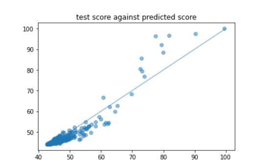

# 实验二报告

## 一. 实验目的

* 使用来自Kaggle 的[数据集](https://www.kaggle.com/mylesoneill/world-university-rankings?select=cwurData.csv)，根据 CWUR 所提供的世界各地知名大学各方面的排名（师资、科研等），构建 [线性回归] 模型， 根据大学各项指标的排名预测综合得分。
  1. 对数据进行观察与可视化，展示数据特点；
  2.  按照 8:2 随机划分训练集测试集，用 RMSE 作为评价指标，得到测试集上线性回归模型的 RMSE 值，并对线性回归模型的系数进行分析；
  3. 尝试其他的回归模型，对比效果；
  4. 尝试将离散的地区特征融入线性回归模型，并对结果进行对比。

* 注意事项：

  * 基本输入特征有 8 个：`quality_of_education`, `alumni_employment`, `quality_of_faculty`, `publications`, `influence`, `citations`, `broad_impact`, `patents`；

  * 预测目标为`score`；

  * 可以使用 `sklearn` 等第三方库，不要求自己实现线性回归；

    

## 二. 数据概览

### 2.1 特征概览和分析

#### 2.1.1 数据概览并做简单的缺失值处理


去除其中包含`NaN`的数据，保留`2000`条有效记录


#### 2.1.2 数据可视化观察

```python
# inspect the the original data
import matplotlib.pyplot as plt

feature_names = ['quality_of_faculty', 'publications', 'citations', 'alumni_employment', 
                'influence', 'quality_of_education', 'broad_impact', 'patents']

fig, axes = plt.subplots(2,4, figsize = (18, 10), dpi = 100)
ax = axes.flatten()
for i, feature in enumerate(feature_names):
  ax[i].scatter(data_df[feature], data_df['score'], alpha = 0.5)
  ax[i].set_title(feature)

plt.show()
```

					  *y-axis: score, x-axis: feature value (feature_visualization.png)*

* 由于此次实验的目的使用的是`linear regression model`， 是一个基于`Euclidian Distance` 来计算的模型，因此选用了`scatter plot`来可视化每一个feature
* 从图中数据散列情况中不难看出， 每一个`feature`与`score`的不存在线性关系，因此在之后的模型训练前需要对数据做了transformation 

#### 2.1.2 尝试预处理

* 通过进一步观察更多的sample data后发现，同一个institution在不同年份有多个不同的采样。因此，仅凭直觉地**对每一个institution的不同年份的数据做了个平均

```python
''' Deprecated '''
# Note that the data set contains more than one year of records of some universities
# take the average scores
df = data_df.groupby('institution')
df.first()
print(df.get_group('Harvard University'))
df = df.mean().reset_index()
df = df.drop(columns = ['year'])
df.sort_values(by='score', ascending=False)
```


* 在这之后的使用以上方式获得的data frame上训练了一个linear regression model，确实得到了一个与naive linear regression model相比更小的`RMSE`值以及更接近`1`的`coefficient of determination`

  

  ​				*naive linear regression model 的 RMSE 为 4.8289，coefficient of determination为 0.5878 (具体的结果请看下一章节)*

* 但经过仔细思考后个人认为这其实多此一举的，且用此方法获得的“更优的”RMSE和coefficient of determination的值并不能体现模型的更优性，原因如下:
  1. 这题的前置assumption是原评分标准不同年份下的计算标准应该是不变的，即 score is independent of year（如果有哪一年评分标准更新了那么要重做模型），因此没有必要对每一个institution的不同年份的取值做平均。
  2. 导致“更优的”RMSE和coefficient of determination的值的原因是这里取了平均，把原数据的error减小了，那必然会得到更优的RMSE和coefficient of determination，但这不意味每一项feature的权值与真实情况更接近了。（再者，其实“更优”也并没有优多少）

（以上为个人看法，如有不对，请务必指出）


## 三. 建立模型

### 3.1 建立基本回归模型

完全按照Least Square推导出来的公式进行的计算

```python
# Linear Regression Model Using Least Square Loss Function
class LinearRegression:

  def __init__(self):
    # B is the beta matrix
    self.B = None

  def fit(self, X, y):
    # print(X.shape, y.shape)
    constants = np.ones(len(X))
    x = np.c_[constants, X]
    # B = (X'X)^(-1) X'Y
    self.B = np.matmul(np.matmul(np.linalg.pinv(np.matmul(x.T, x)), x.T), y)

  def predict(self, X):
    constants = np.ones(len(X))
    x = np.c_[constants, X]
    return np.matmul(x, self.B)


# metrics functions
def MSE(y, y_hat):
  err = y - y_hat
  err_square = np.matmul(err.T, err)
  mse = err_square/len(y)
  return mse

def RMSE(y, y_hat):
  err = y - y_hat
  err_square = np.matmul(err.T, err)
  rmse = np.sqrt(err_square/len(y))
  return rmse

def cal_determination_coefficient(y, y_hat):
  return 1-MSE(y, y_hat)/np.var(y)
```

### 3.2 初模型评估

```python
# the naive model
LR = LinearRegression()
LR.fit(x_train, y_train)
p_test = LR.predict(x_test)
rmse = RMSE(y_test, p_test)
print("RMSE =", rmse)
# calculate the cofficient of determination
determination_coefficient = cal_determination_coefficient(y_test, p_test)
print("coefficient of determination: {:.4f}\n".format(determination_coefficient))

# inspect the weights
import copy
b = copy.deepcopy(LR.B)
b_names = copy.deepcopy(feature_names)
b_names.insert(0, 'y-intercept')
# sort b from least to largest
for i in range(len(b)):
  for j in range(len(b)-i-1):
    if b[j]>b[j+1]:
      b[j], b[j+1] = b[j+1], b[j]
      b_names[j], b_names[j+1] = b_names[j+1], b_names[j]

print("weights:")
for i in range(len(b)):
  print("{}:{:.5f}".format(b_names[i], b[i]))
```

* 结果：

  

* test score against predicted score:

  

* 分析：
  1. `y-intercept`为`64.71109`是一个`基准分`，即在所有`feature`的排名值为`0`时的得分。
  2. 从不同特征的权值来看，权值为负表示当前特征的排名越靠后，扣的`score`越多。
  3. 其中，`quality_of_faculty`对`score`的影响最大且为负分，每靠后一名，扣约`0.05772`分。`citations`的对`score`的影响最小。对`score`加分最大的是`influence`。

显然，这个模型存在问题，因为最大得分也只有`64.71109`左右，且有些特征排名越靠后反而得到更高的分数。


## 四. 模型调优

### 4.1 特征变换

#### 4.1.1 尝试使用inverse

* 从最初的数据分布情况（*feature_visualization.png*）来看，很自然地想到可以用inverse来做变换

```python
# Data Transformation
# method 1. take inverse of all feature values
all_x3 = copy.deepcopy(all_x)
for i, col in enumerate(all_x3):
  for j, val in enumerate(col):
    all_x3[i][j] = 1/val
```

* 初次inverse后的数据分布：

  

* 结果：

  

* 分析：

  1. inverse并没有使得`RMSE`和`coefficient of determination`的值更优，一开始作者将导致这一现象的原因归结于数据集中存在`outlier`。

  2. 但经过思考后，个人认为**本次数据集不应该存在任何的outlier，只是我们的模型存在偏差，不能完全描述真实的模型**。其原因在于：

     首先`outlier`的定义和主要来源：

     > In statistics, an outlier is a data point that differs significantly from other observations.
     >
     > ​															*-- source: Wikipedia [Ourlier]( https://en.wikipedia.org/wiki/Outlier)*

     > There are three causes for outliers — **data entry/An experiment measurement errors, sampling problems, and natural variation**
     >
     > ​											*-- source: Medium [It's all about Outliers](https://medium.com/analytics-vidhya/its-all-about-outliers-cbe172aa1309#:~:text=There%20are%20three%20causes%20for,sampling%20problems%2C%20and%20natural%20variation.&text=An%20error%20can%20occur%20while,the%20wrong%20value%20by%20mistake.&text=Outliers%20can%20occur%20while%20collecting%20random%20samples.)*

     由于本次数据集是来自权威的评估机构：世界大学排名中心（Center for World University Rankings，缩写CWUR）以评估教育质量、校友就业、研究成果和引用，而非依赖于调查和大学所提交的数据著称，是非常有影响力的一个。

     因此，结合`outlier`的定义和来源可以判断此数据集是不存在`outlier`的，最多可能存在一定的`bias`。

     所以，清理`outlier`是完全没有必要的，如果做了这步，反而可能会造成最终的回归模型的`RMSE`和`coefficient of determination`的值更差

* 综上所述，选择不去除`outlier`，而是尝试在inverse的基础上使用log函数再次transform，使得数据点更贴合线性模型

```python
all_x3 = copy.deepcopy(all_x)
for i, col in enumerate(all_x3):
  for j, val in enumerate(col):
    all_x3[i][j] = np.log(1000/val)  # numerator is 1000 is to avoid negative value that log function can not take in
```

* 再次处理后的数据分布：

  

  ​								 *tranformation_log(inverse).png*

* 结果：

  

* 分析：

  这个模型虽然`RMSE`和`coefficient of determination`更优了，但**并不make sense**：最高分竟然为`32.79852` (`y-intercept`)， 且对于所有的特征而言排名越靠后，总得分越高。因此不采用此优化方案。

#### 4.1.2 尝试使用log

使用log的原因：排名为1的时候应该不扣分。排名越靠后，扣分越多。但是没下降一名对分数的影响越小。符合此问题的情况。

```python
# Data Transformation
# mehtod 2. take natural log of all feature values
all_x2 = copy.deepcopy(all_x)
for i, col in enumerate(all_x2):
  for j, val in enumerate(col):
    all_x2[i][j] = np.log(val)
```

* 初次log的数据分布：

  

* 结果：

  

  

* 分析：
  1. `RMSE`和 `coefficient of determination`更优了
  2. `y-intercept`，即基准值，约为`100.33937`，十分接近`100分`满分。
  3. 所有特征的权值都为负，表明对于所有的特征而言，每排名落后一名，总分被扣分。make sense。
  4. 其中，`quality_of_faculty`所占的权重最大，每落后一名，总分被扣约`4.2166`分；而`citations`所占的权重最小，每落后一名，总分仅被扣约`0.1414`分

总体而言，经过log后的模型十分合理，可以看出CWUR对于一个大学的评估是站在学生的角度，更加看重于教学质量和毕业后学生的就业情况，而非仅仅教职员工的研究论文产出。

### 4.2 尝试Max-Min Normalization

```python
# try normalization and standardization
X1 = copy.deepcopy(X)
for c in X1.columns:
  X1[c] = np.log(X1[c])
  X1[c] = (X1[c]-X1[c].min())/(X1[c].max()-X1[c].min())
```

* Max-Min Normalization的结果：

  

  * 分析：

    首先`Max-Min Normalization`是可行的，因为上文已经讨论过了本数据即不存在`outlier`。

    而模型的`RMSE`和`coefficient of determination`不受影响是因为每一个特征都是排名的取值，所有排名都是上升一名或下降一名，因此所有特征本来就是在同一个scale上的，没有必要做任何feature scaling。而做了feature scaling后的效果就是将各项feature的权值放大了

* 本数据即并没有`standardization`的必要，是因为没有必要且每个feature的数据分布也并非follow normal distribution

  

## 五. 其他回归模型比较

### 5.1 Linear Models

* 使用sklearn库的linear regression model, 对比我们用log函数优化的结果来看， 可以判断出sklearn库的linear regression model内部对数据进行了log变换。其结果与手写的非常一致，各特征的权重及`RMSE`，`coefficient of determination`的值相差甚微。

  

* Ridge

  

* Lasso

  

* Elastic Net

  

* RANSAC 

  

* Gradient Descent Regression

  

### 5.2 Other regression models

* Decision Tree Regressor

  

* Random Forest Regressor

  

* Multilayer Perception(MLP) Regressor

  

对以上的regression模型，由于时间关系，没有逐个深究其原理以及对比分析使用条件

## 七 . 加入离散地区特征

原数据集包含了共59个不同的地区


### 7.1 One Hot Encoding

* 将categorical data转化成numerical data，以便于linear regression模型的计算

  ```python
  # add the region as a predictor of the model
  from sklearn.preprocessing import MaxAbsScaler, MinMaxScaler, Normalizer, OneHotEncoder
  import math
  # Generate region onehot values
  regions = [[r] for r in region_names]
  enc = OneHotEncoder()
  enc.fit(regions)
  regions = [[r] for r in data_df['region']]
  
  regions = enc.transform(regions).toarray()
  
  for i, r in enumerate(regions):
    val = data_df['national_rank'][200+i]
    regions[i] = regions[i]*math.log(val) 
  # inspect
  print(regions[100])
  
  all_x5 = np.c_[all_x2, regions]
  ```

* 结果：

  

* 分析：
  1. `RMSE`减小了，且coefficient of determination`比log的模型更接近`1`，说明这个这个机构的评分标准对不同的国家有存在的一定的bias。对于一些国家，可能会有加分情况，而对于另一些国家存在减分的情况。
  2. 并不排除过拟合的可能性，毕竟国家的个数太多了。

## 八. 总结

### 8.1 实验结果

最终模型就是加入国家后取log的模型。

`RMSE` = `2.3830`, `coefficient of determination` = `0.8996`


