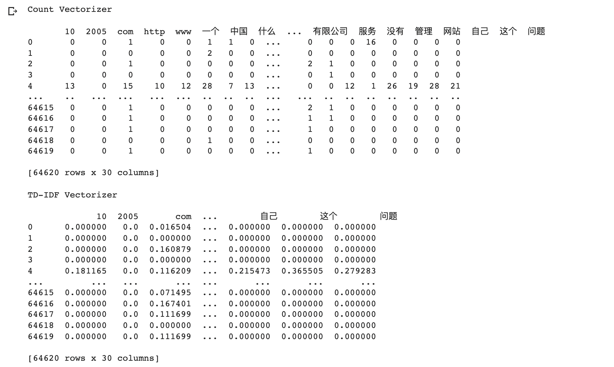
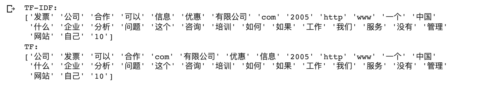
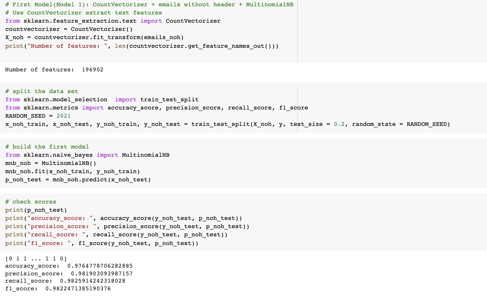

# 实验三报告

## 一. 实验目的

本次实验数据集来自[Trec06](https://plg.uwaterloo.ca/cgi-bin/cgiwrap/gvcormac/foo06)的中文垃圾邮件数据集，目录解压后包含三个文件夹，其中data目录下是所有的邮件（未分词），已分词好的邮件在data_cut目录下。邮件分为邮件头部分和正文部分，两部分之间一般有空行隔开。标签数据在label文件夹下，文件中每行是标签和对应的邮件路径。‘spam’表示垃圾邮件，‘ham’表示正常邮件。

* 使用朴素贝叶斯算法完成垃圾邮件的分类与预测，要求测试集Accuracy、Precision、Recall均高于0.9；
* 对比特征数目（词表大小）对模型效果的影响；
* 邮件头信息有时也可以协助判断垃圾邮件；
* 尝试自行实现朴素贝叶斯算法细节；
* 尝试对比不同的概率计算方法。


## 二. 特征提取与初模型建立

### 2.1 语料读取

将所有邮件从data_cut文件夹中读取并过滤头部信息，分别保存到`emails_h` 和 `emails_noh`里。

*	`emails_h` 保存有头部信息的email

* `emails_noh` 保存没有头部信息的email

```python
# load corpora
import os

data_cut = '/content/drive/MyDrive/Colab Notebooks/ML lab/Lab3/trec06c-utf8/data_cut'
folders = os.listdir(data_cut)
folders.sort(key=int) # the order is messed up upon reading files from google drive
# print(folders)

emails_h = []
emails_noh = []
for folder in folders:
    subpath = data_cut +'/'+folder
    files = os.listdir(subpath)
    files.sort(key=int) # the order is messed up upon reading files from google drive
    # print(files)

    for file in files:
        filepath = subpath + '/' + file
        email_h = "" # with header
        email_noh = "" # without header
        header = True # flag to find out the header boundary
        with open(filepath, "r", encoding = 'utf-8') as f:
            lines = f.readlines()
            for line in lines:
                if line == '\n': header = False
                if header: 
                    email_h += line.strip('\t').replace('\n', ' ')
                    continue
                email_h += line.strip('\t').replace('\n', ' ')
                email_noh += line.strip('\t').replace('\n', ' ')
            emails_h.append(email_h)
            emails_noh.append(email_noh)            
            
print(emails_h[0])
print(emails_noh[0])
```

### 2.2 特征提取

#### 2.2.1 方法一. `CountVectorizer`

`CountVectorizer` : 仅是对每个email中的出现的`word`进行频率统计，i.e. **term frequency**

#### 2.2.2 方法二. TfidfVectorizer

`TfidfVectorizer`：

* 全称：**term-frequency + inverse document frequency**

* formula:  $TF(w_i, d_j) \cdot IDF(w_i)$

  ​			= # of times word $w_i$ Appears in a doc $d_j$ + $log(\frac{1+n}{1+\ df(d_j,w_i)})+1$

  *	$df(d_j, w_i) $ - document frequency of the word $w_i$
  *	$n$ - # of documents

* 不仅包含了**term frequency**，由于乘上了**Inverse document frequency**, 这对每个`word` 的重要性进行了评估, 对于那些在所有documents中出现评率很高的word进行了惩罚

### 2.3 初模型建立

#### 2.3.1 建模型

* 使用CountVectorizer

  

* 使用Tfidfvectorizer

  


*	分析：对比可以看出，使用`TfidfVectorizer` 的效果更好，原因在于对于每个word都考虑了它的重要性。

观察一下CounterVectorizer和Tfidfvectorizer所产生的词表不同:

```python
# inspect the top 20 most frequent features
countvectorizer = CountVectorizer(max_features = 30)
tfidfvectorizer = TfidfVectorizer(max_features = 30)
cv_fit = countvectorizer.fit_transform(emails_noh)
tv_fit = tfidfvectorizer.fit_transform(emails_noh)
count_tokens = countvectorizer.get_feature_names_out()
tfidf_tokens = tfidfvectorizer.get_feature_names_out()
df_countvect = pd.DataFrame(data = cv_fit.toarray(), columns = count_tokens)
df_tfidfvect = pd.DataFrame(data = tv_fit.toarray(), columns = tfidf_tokens)
print("Count Vectorizer\n")
print(df_countvect)
print("\nTD-IDF Vectorizer\n")
print(df_tfidfvect)
```



```python
# inspect the sorted top 20 tfidf-ranked words
import numpy as np

def get_top_frequent_words(response, top_n, vectorizer):
    feature_array = np.array(vectorizer.get_feature_names_out())
    sorting = np.argsort(response.toarray()).flatten()[::-1]
    return feature_array[sorting][:top_n]

print("TF-IDF:")
print(get_top_frequent_words(tv_fit, 30, tfidfvectorizer))  
print("TF:")
print(get_top_frequent_words(cv_fit, 30, countvectorizer))  
```



经过排序后可以看出例如“发票”，“合作”，“有限公司”，“优惠”等词汇变得更重要了


## 三. 对比加入文件头信息对模型效果的影响

```python
# First Model(Model 1): CountVectorizer + emails without header + MultinomialNB
# Use CountVectorizer extract text features
from sklearn.feature_extraction.text import CountVectorizer
countvectorizer = CountVectorizer()
X_noh = countvectorizer.fit_transform(emails_noh)
print("Number of features: ", len(countvectorizer.get_feature_names_out()))
# split the data set
from sklearn.model_selection  import train_test_split
from sklearn.metrics import accuracy_score, precision_score, recall_score, f1_score
RANDOM_SEED = 2021
x_noh_train, x_noh_test, y_noh_train, y_noh_test = train_test_split(X_noh, y, test_size = 0.2, random_state = RANDOM_SEED)
# build the first model
from sklearn.naive_bayes import MultinomialNB
mnb_noh = MultinomialNB()
mnb_noh.fit(x_noh_train, y_noh_train)
p_noh_test = mnb_noh.predict(x_noh_test)
```

```python
# Model 2. CountVectorizer + emails with header + MultinomialNB
countvectorizer = CountVectorizer()
X_h = countvectorizer.fit_transform(emails_h)
print("Number of features: ", len(countvectorizer.get_feature_names_out()))
MAX_FEATURES = len(countvectorizer.get_feature_names_out())
x_h_train, x_h_test, y_h_train, y_h_test = train_test_split(X_h, y, test_size = 0.2, random_state = RANDOM_SEED)
mnb_h = MultinomialNB()
mnb_h.fit(x_h_train, y_h_train)
p_h_test = mnb_h.predict(x_h_test)
```

效果：

| Model 1.  emails without header                              | Model 2. emails with header                                  |
| ------------------------------------------------------------ | ------------------------------------------------------------ |
|  |  |

* 分析：

  对比可以看出加上头部信息中有许多有效信息，使得模型的accuracy和f1 score都增加了，同时false positive rate大幅度减小。

  

## 四. 对比词表大小对模型效果的影ß响

通过改变`TfidfVectorizer`的参数max_features来改变词表大小；`TfidfVectorizer`会收录最高`tfidf` 得分的词汇作为词表词汇

```python
# vary the number of features in the vocabulary
acc_scores = []
prec_scores = []
recall_scores = []
f1_scores = []
fp_rates = []
feature_number = []
for exp in range(2, 20):
    numOfFeatures = 2**exp
    if numOfFeatures > 2*MAX_FEATURES: break
    feature_number.append(numOfFeatures)
    tv = TfidfVectorizer(max_features = numOfFeatures)
    X_h = tv.fit_transform(emails_h)
    print("Number of features: ", len(tv.get_feature_names_out()))
    x_h_train, x_h_test, y_h_train, y_h_test = train_test_split(X_h, y, test_size = 0.2, random_state = RANDOM_SEED)
    mnb_h = MultinomialNB()
    mnb_h.fit(x_h_train, y_h_train)
    p_h_test = mnb_h.predict(x_h_test)
    acc = accuracy_score(y_h_test, p_h_test)
    print("accuracy_score: ", acc)
    acc_scores.append(acc)
    prec = precision_score(y_h_test, p_h_test)
    print("precision_score: ", prec)
    prec_scores.append(prec)
    r = recall_score(y_h_test, p_h_test)
    print("recall_score: ", r)
    recall_scores.append(r)
    f1 = f1_score(y_h_test, p_h_test)
    print("f1_score: ", f1)
    f1_scores.append(f1)
    tp, tn, fp, fn = confusion_matrix(y_h_test, p_h_test)
    print("False positive rate: ", fp)
    fp_rates.append(fp)
```

* 效果：

  

  

*	分析： 从上图中可以直观地看出词表越大越全，对文本类别识别的效果更好。


## 五. 对比不同概率计算方法

#### 5.1 BernulliNB


#### 5.2 MultinomialNB



#### 5.3 ComplementNB


* **分析：**

  对比可以发现其中ComplementNB和MultinomialNB的模型预测效果比BernulliNB相对更好一些；

  ComplementNB表现较好是因为本次的dataset是较为不平衡的i.e. imbalanced dataset，即在训练集中某一些class的样例比另一些class的样例更多，这就意味着数据的分布是不平均的(non-uniform distribution)，这样的训练集可能会造成模型overfit，导致模型有很大的bias。因此相对于如仅考虑一个feature是否属于一个class的概率的MultinomialNB和BernulliNB模型而言，ComplementNB考虑了一个feature是否属于所有class的概率, 因此效果相对于BernulliNB更好； 

  BernulliNB仅仅单一地考虑每个feature存在与不存在一个class中，而忽视了每个feature出现的频率，因此效果没有那么好；

  至于为何ComplementNB没有MultinomialNB效果好的原因我想是因为此次数据集虽然是不平均的i.e. 一共有64620个样例，其中Spam的有42854例，但是由于Conventional 后验概率P(Spam)约为0.8，P(Ham)约为0.2，即真实情况就是imbalanced的，所以不需要消除这一imbalance性。以上是个人考虑，还需深入探究。

  


## 六. 尝试自行实现Naive Bayes算法细节

```python
# try to implement MultinomialNB
class MultinomialNaiveBayes(object):
  def __init__(self):

    # records of the conditional probabilities for each word in vocabulary
    self._parameters_spam = None
    self._parameters_ham = None

    # the priors
    # here determine the priors according to the given training data set instead of traditional 0.8:0.2 ratio
    self._p_spam = None
    self._p_ham = None


  def fit(self, X, y):
    # Naive Bayes:
    # P(Spam|w1,w2,...,wn) is proportional to  P(Spam)·[P(w1|Spam)P(w2|Spam)...P(wn|Spam)]
    # P(Ham|w1,w2,...,wn) is proportional to P(Ham)·[P(w1|Ham)P(w2|Ham)...P(wn|Ham)]

    # 1. calculate P(Spam) and P(Ham)
    numOfSpam = y.count(1)
    numOfHam = len(y) - numOfSpam
    self._p_spam = numOfSpam/len(y_h_train)
    self._p_ham = numOfHam/len(y_h_train)

    # 2. calculate P(wi|Spam) and P(wi|Ham) using multinomial formula
    numOfDocs, numOfVocab = X.get_shape()

    spam_word_count = np.zeros(numOfVocab)
    ham_word_count = np.zeros(numOfVocab)
    tot_spam_word_count = 0
    tot_ham_word_count = 0
    for i in range(len(y)):
      if y[i] == 1:
        tot_spam_word_count+=X.getrow(i).sum()
        spam_word_count += X.getrow(i).toarray()[0]
      else:
        tot_ham_word_count+=X.getrow(i).sum()
        ham_word_count += X.getrow(i).toarray()[0]

    # assume Laplace smoothing
    alpha = 1

    # 3. compute the probability for each word given the class
    self._parameters_spam = (spam_word_count + alpha) / (tot_spam_word_count + alpha*numOfVocab)
    self._parameters_ham = (ham_word_count + alpha) / (tot_ham_word_count + alpha * numOfVocab)


  def predict(self, X):
    numOfDocs, numOfVocab = X.get_shape()
    predictions = np.zeros(numOfDocs)

    cx = X.tocoo()
    for doc_index in range(numOfDocs):
      # the posteriors
      p_spam_given_word = np.log(self._p_spam)
      p_ham_given_word = np.log(self._p_ham)
      for word_index in range(numOfVocab):
        # if word is present in the document
        if X[doc_index, word_index]>0:
          if self._parameters_spam[word_index]>0:
            p_spam_given_word += np.log(self._parameters_spam[word_index])
          if self._parameters_ham[word_index]>0:
            p_ham_given_word += np.log(self._parameters_ham[word_index])


      if p_spam_given_word > p_ham_given_word:
        predictions[doc_index] = 1
      else:
        predictions[doc_index] = 0

    return predictions
```

*注意: 在计算prediction时要take log，避免underflow，因为概率连乘后的数值非常小*

* 以下是仅使用了前1000个email的效果，其中800个email作为训练集，200个email的测试集(自己写的复杂度有点高，算力不够)：


## 七. 总结

Naive Bayes的之所以是naive的主要核心在于它assume每个特征的属性的都是独立的；这样才有连乘这一转换， 即

 $p(c|f_1,...,f_n)∝p(c)\cdotp(f_1|c)...p(f_n|c)$

简化计算。
