# 实验五报告

## 一. 实验目的

每年国际上召开的大大小小学术会议不计其数，发表了非常多的论文。在计算机领域的一些大型学术会议上，一次就可以发表涉及各个方向的几百篇论文。按论文的主题、内容进行聚类，有助于人们高效地查找和获得所需要的论文。本案例数据来源于AAAI 2014上发表的约400篇文章，由[UCI](https://archive.ics.uci.edu/ml/datasets/AAAI+2014+Accepted+Papers!)公开提供，提供包括标题、作者、关键词、摘要在内的信息，希望大家能根据这些信息，合理地构造特征向量来表示这些论文，并设计实现或调用聚类算法对论文进行聚类。最后也可以对聚类结果进行观察，看每一类都是什么样的论文，是否有一些主题。

本次实验以AAAI 2014会议论文数据为基础，要求实现或调用无监督聚类算法，了解聚类方法。

1. 将文本转化为向量，实现或调用无监督聚类算法，对论文聚类，例如10类（可使用已有工具包例如sklearn）；
2. 观察每一类中的论文，调整算法使结果较为合理；
3. 无监督聚类没有标签，效果较难评价，因此没有硬性指标，跑通即可，主要让大家了解和感受聚类算法，比较简单。
4. 对文本向量进行降维，并将聚类结果可视化成散点图。

注：group和topic也不能完全算是标签，因为

1. 有些文章作者投稿时可能会选择某个group/topic但实际和另外group/topic也相关甚至更相关；
2. 一篇文章可能有多个group和topic，作为标签会出现有的文章同属多个类别，这里暂不考虑这样的聚类；
3. group和topic的取值很多，但聚类常常希望指定聚合成出例如5/10/20类；
4. 感兴趣但同学可以思考利用group和topic信息来量化评价无监督聚类结果，不作要求。

提示：

1. 高维向量的降维旨在去除一些高相关性的特征维度，保留最有用的信息，用更低维的向量表示高维数据，常用的方法有PCA和t-SNE等；
2. 降维与聚类是两件不同的事情，聚类实际上在降维前的高维向量和降维后的低维向量上都可以进行，结果也可能截然不同；
3. 高维向量做聚类，降维可视化后若有同一类的点不在一起，是正常的。在高维空间中它们可能是在一起的，降维后损失了一些信息。


## 二.  特征提取

使用`Tfidfvectorizer`来提取文本信息。 这里每列单独处理。

原数据共有398例，去除`Na`的数据后剩下392例。

```python
# feature extraction
from sklearn.feature_extraction.text import TfidfVectorizer
tv = TfidfVectorizer()
title = tv.fit_transform(data_df['title'])
print(tv.get_feature_names_out())
```

```python
tv = TfidfVectorizer(ngram_range=(1,6))
groups = tv.fit_transform(data_df['groups'])
print(tv.get_feature_names_out())
```

```python
tv = TfidfVectorizer(ngram_range=(1,6))
keywords = tv.fit_transform(data_df['keywords'])
print(tv.get_feature_names_out())
```

```python
tv = TfidfVectorizer(ngram_range=(1,6))
topics = tv.fit_transform(data_df['topics'])
print(tv.get_feature_names_out())
```

```python
tv = TfidfVectorizer(ngram_range=(1,2))
abstract = tv.fit_transform(data_df['abstract'])
print(tv.get_feature_names_out())
```

整合并给不同的列加了权重

```python
from scipy.sparse import hstack
X = hstack([title, 2*groups, 2*keywords, 2*topics, abstract])
```


## 三. 模型构建

这里考虑用了KMeans来做flat聚类，因为本数据集没有明显的hierarchical structure。规定了10个clusters。

```python
from sklearn.cluster import KMeans

kmeans  = KMeans(n_clusters = 10, init='k-means++')
cluster_labels = kmeans.fit_predict(X)
kmeans.labels_
```

观察结果， 以下是每一条实例所属的cluster


cluster_labels  0: Computational Sustainability and AI (CSAI)

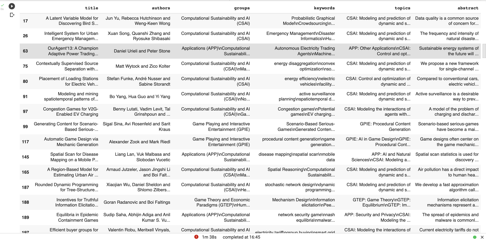

cluster_labels 1: Game Theory and Economic Paradigms (GTEP)


cluster_labels 2: Vision(VIS), Robotics(ROS)


cluster_labels 3: NLP and Machine Leaning(NLPML), Machine Learning Applications(MLA), Novel Machine Learning Algorithms(NMLA)


cluster_labels 4: Cognitive Modeling (CM), Multiagent Systems (MAS), Cognitive Systems (CS), Humans and AI(HAI)

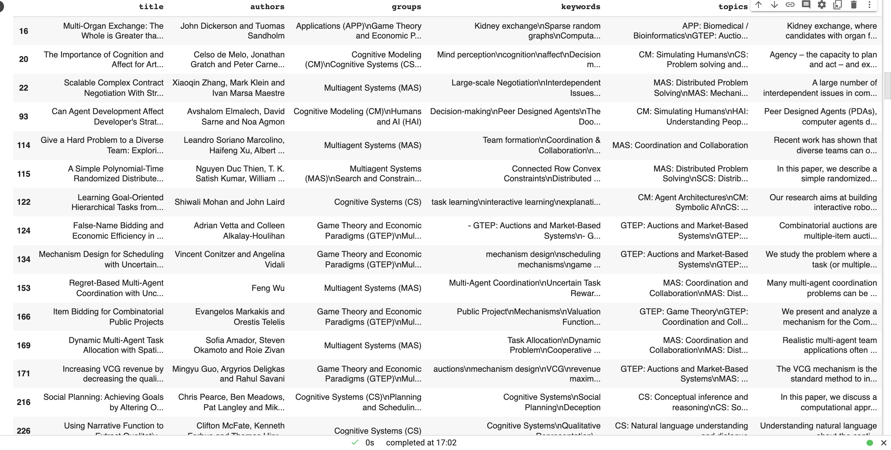

cluster_labels 5: AI and the Web(AIW)

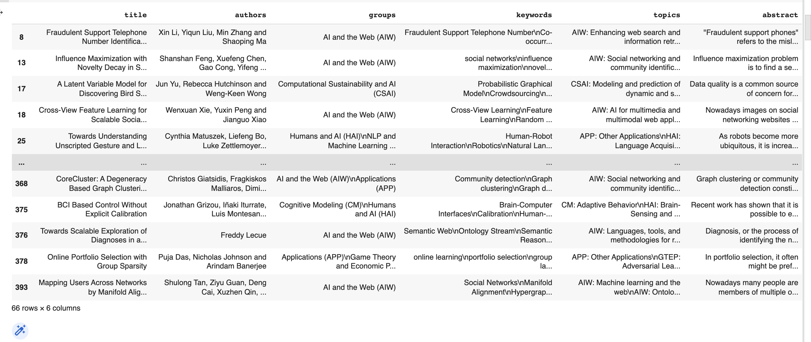

cluster_labels 6: AI and the Web (AIW), NLP and Text Mining (NLPTM)


cluster_labels 7: Knowledge Representation and Reasoning (KRR)


cluster_labels 8: Heuristic Search and Optimization (HSO), Search and Constraint Satisfaction (SCS)


cluster_labels 9: Applications (APP)


## 四. 聚类结果可视化

使用t-SNE降为

```python
from sklearn.manifold import TSNE
features_embedded = TSNE(n_components=2).fit_transform(X)
features_embedded.shape
```

作图

```python
import matplotlib.pyplot as plt
import seaborn as sns

sns.set()

for i in range(10):
  plt.scatter(features_embedded[cluster_labels==i][:,0], features_embedded[cluster_labels == i][:,1], label = i)  
plt.legend(loc='best')
plt.tight_layout()
```

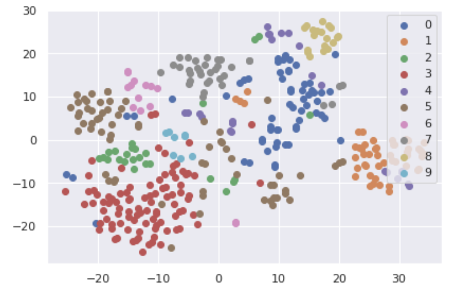

可以看到较相似的、有交叉的实例聚集在了一起。


## 五. 尝试模型调整

这里尝试调整了一下不同的权值，强调了文章的`content`

```python
X = hstack([2*title, groups, 2*keywords, topics, 2*abstract])

kmeans  = KMeans(n_clusters = 10, init='k-means++')
cluster_labels = kmeans.fit_predict(X)
kmeans.labels_
```


cluster_label 0:


cluster_labels 1: 

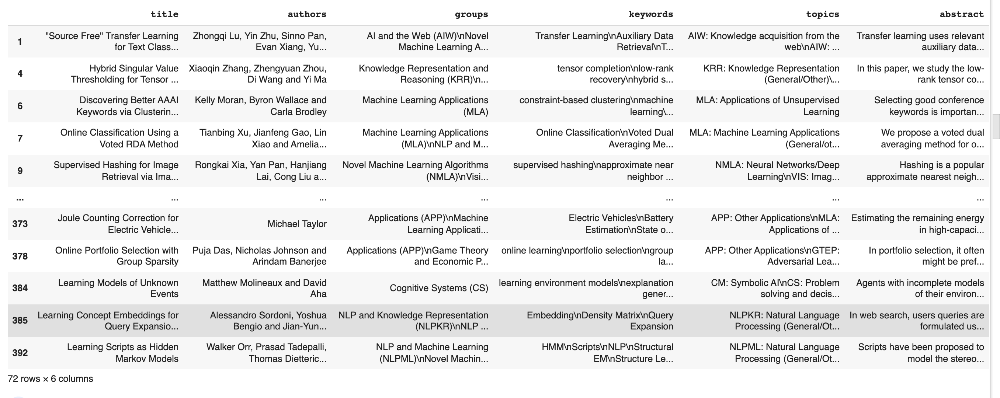

cluster_labels 2: 


cluster_labels 3: 

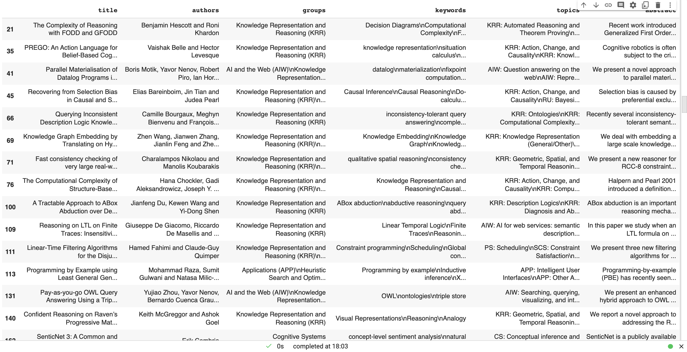

cluster_labels 4: 


cluster_labels 5:


cluster_labels 6: 

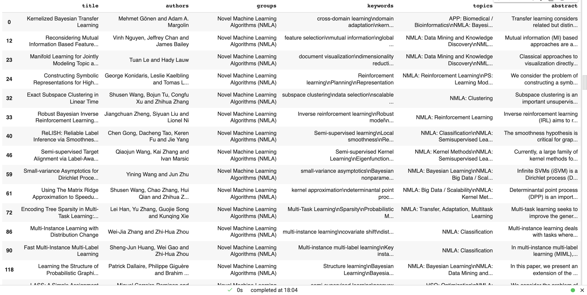

cluster_labels 7:

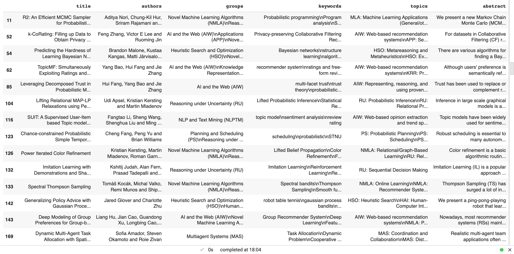

cluster_labels 8:


cluster_labels 9:    

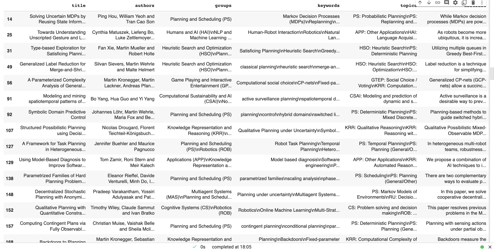

作图：

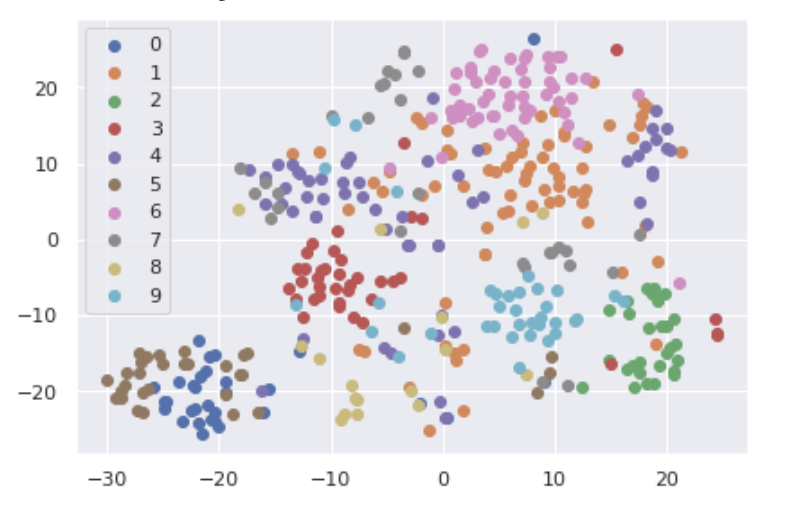

可以看到不同的聚类效果， 但由于语义处理得可能不够好，因此有些聚类的定义不明确。


##  六. 尝试implement `KMeans++`模型

K-means算法的一个缺点是它对centroid的初始化很敏感， 因为是随机选取任意点，有时候可能centroids间的距离很近，导致iteration次数很大，计算量增加。因此希望初始化时扥centroids间的距离就尽可能远，在这样他们在更有可能不在同一个cluster内。而KMeans++就是对这一初始化做了一个优化。

```python
# TODO: implementation of k-means++
class KMeans_pp(object):
  def __init__(self, n_clusters=5):
    self.centroids_ = None
    self.labels_ = None
    self.n_clusters_ = n_clusters

  def fit_predict(self, X):
    centroids = self._get_centroid(X)
    X1 = X.toarray()

    isDiff = True
    while isDiff:
      labels = [0]*(X1.shape[0])
      for i in range(X1.shape[0]):
        point = X1[i,:]
        dist = []
        for j in range(len(centroids)):
          dist.append(self._distance(point, centroids[j]))
        dist = np.array(dist)
        labels[i] = np.argmin(np.array(dist))

      no_change = True
      for c_id in range(len(centroids)):
        labels = np.array(labels)
        points_in_c = X1[np.where(labels == c_id),:]
        new_c = np.mean(points_in_c, axis=1)
        if not (new_c == centroids[j]).all():
          no_change = False
          centroids[j] = new_c
      if no_change: isDiff = False

    self.centroids_ = centroids
    self.labels_ = labels 
    return self.labels_

  
  # compute the euclidean distance
  def _distance(self, p1, p2):
    return np.sum((p1-p2)**2)

  def _get_centroid(self, X):
    X1 = X.toarray()
    nsamples, nfeatures = X1.shape
    # stores the index of data point in the sample
    centroids = []
    centroids.append(X1[np.random.choice(X1.shape[0], 1, replace=False), :])

    for c_id in range(self.n_clusters_-1):
      dist = []
      for i in range(X1.shape[0]):
        point = X1[i,:]
        d = np.inf
        # calculate the distance of every centriod with every other data point
        for j in range(len(centroids)):
          temp_dist = self._distance(point, centroids[j])
          d = min(d, temp_dist)
        dist.append(d)
      
      dist = np.array(dist)
      next_centroid = X1[np.argmax(dist), :]
      centroids.append(next_centroid)
    
    return centroids
```

*感觉存在问题，时间复杂度有点高，测试不出来，但由于时间关系这里不做调整了，以后有时间再检查。*

## 

## 七. 最优cluster个数

这里做了其他不同的`n_clusters`的尝试

### 7.1 Elbow Method

```python
# determine the optimal number of clusters for k Means
# The Elbow Method

# calculate the Within-Cluster-Sum of Squared Erorrs for different values of k
# choose the k for which WSS becomes first starts to diminish
def calculate_WSS(points, kmax):
  points = points.toarray()
  sse = []
  for k in range(1, kmax+1):
    kmeans = KMeans(n_clusters = k).fit(points)
    centroids = kmeans.cluster_centers_
    pred_clusters = kmeans.predict(points)
    curr_sse = 0
    
    # calculate square of Euclidean distance of each point from its cluster center and add to current WSS
    for i in range(len(points)):
      curr_center = centroids[pred_clusters[i]]
      curr_sse += (points[i, 0] - curr_center[0]) ** 2 + (points[i, 1] - curr_center[1]) ** 2
      
    sse.append(curr_sse)
  return sse
```

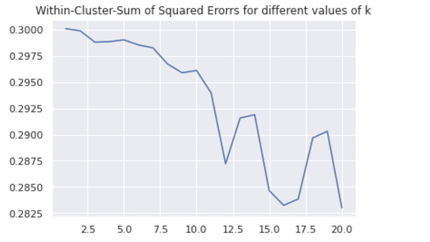

### 7.2 Silhouette Method

```python
# Silhouette Method
# the silhouette values measures how similar a point is to its own cluster(cohesion) compared to other cllusters(separation)
from sklearn.metrics import silhouette_score

sil = []
kmax = 20

# dissimilarity would not be defined for a single cluster, thus, minimum number of clusters should be 2
for k in range(2, kmax+1):
  kmeans = KMeans(n_clusters = k).fit(X)
  labels = kmeans.labels_
  sil.append(silhouette_score(X, labels, metric = 'euclidean'))
```

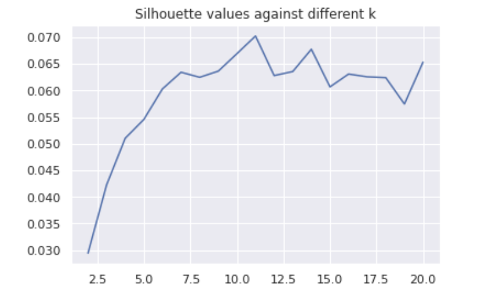

从以上两个图来看，n_clusters = 10 是一个相对较好的选择。


## 八.  总结

`unsupervised learning` 因为没有label，所以很难评价以及判断一个模型效果是否好，需要观察结果来看一个模型是否能derive一些有用的结果。


