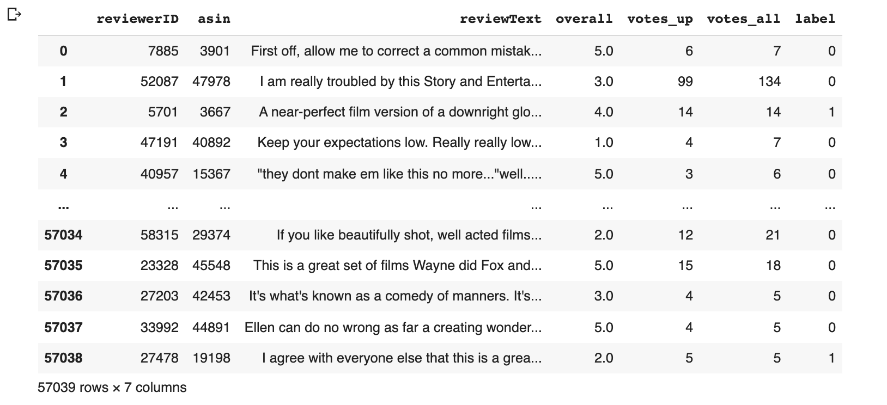
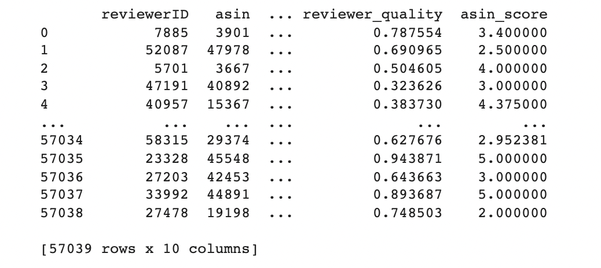
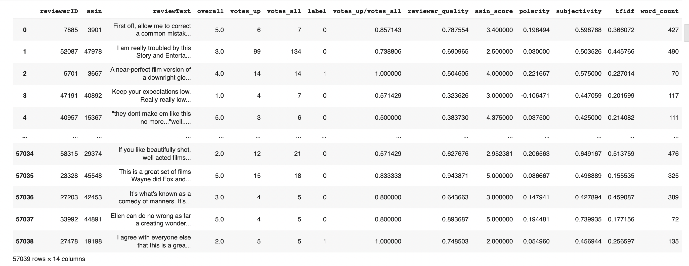
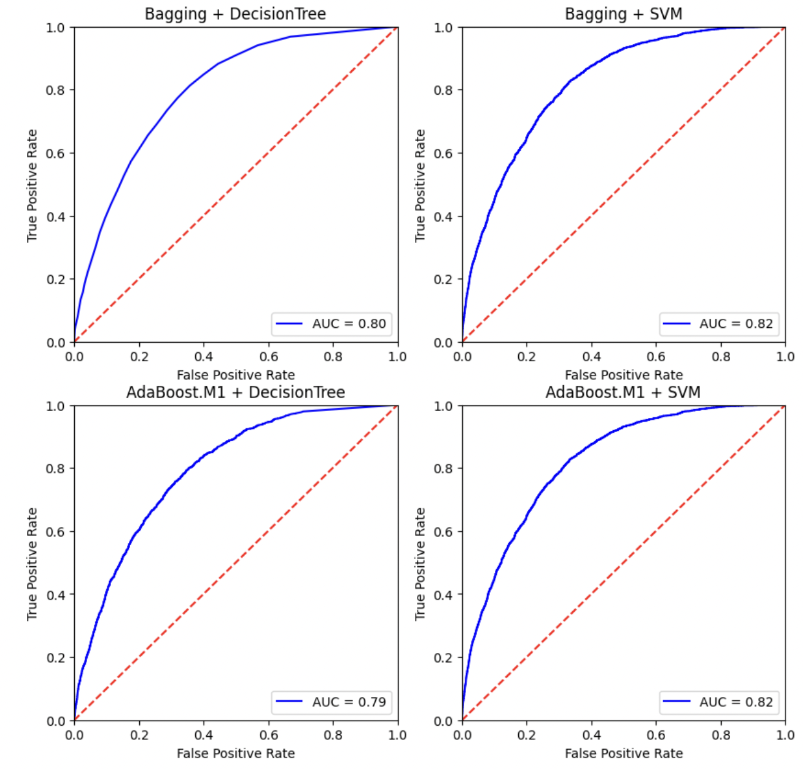
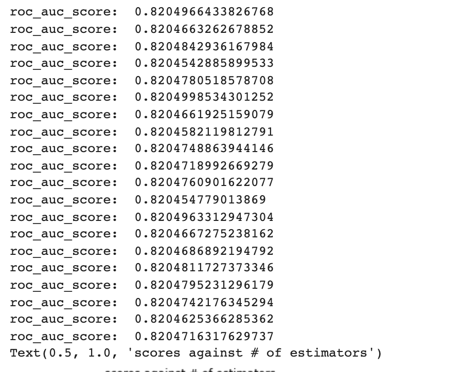
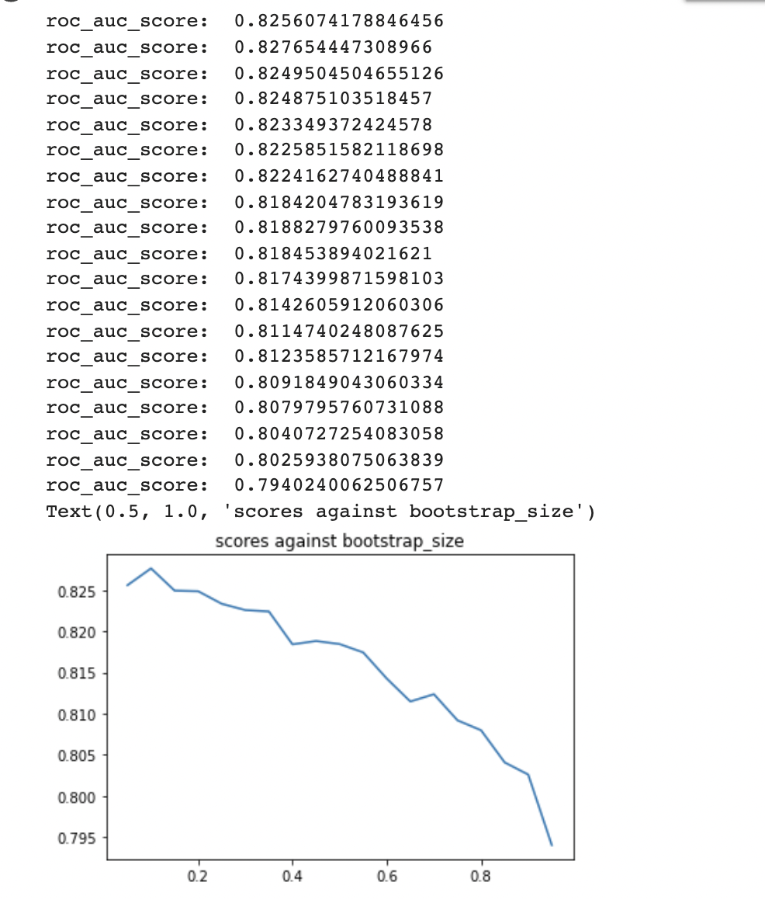
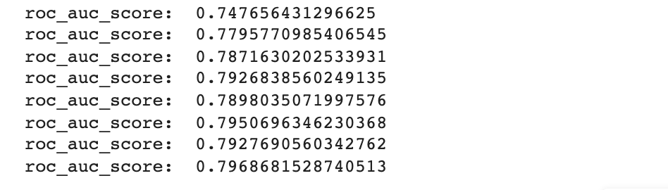
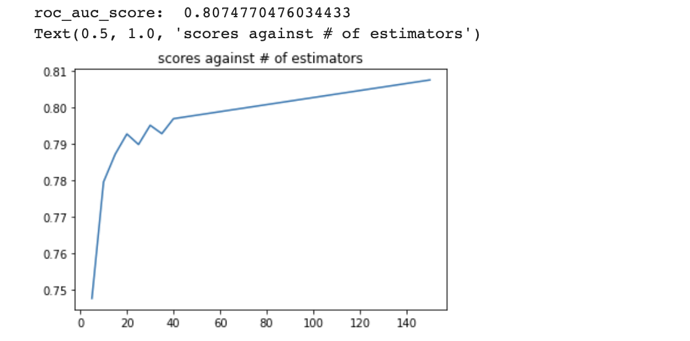

# 实验六报告

## 一. 实验目的

随着电商平台的兴起，以及疫情的持续影响，线上购物在我们的日常生活中扮演着越来越重要的角色。在进行线上商品挑选时，评论往往是我们十分关注的一个方面。然而目前电商网站的评论质量参差不齐，甚至有水军刷好评或者恶意差评的情况出现，严重影响了顾客的购物体验。因此，对于评论质量的预测成为电商平台越来越关注的话题，如果能自动对评论质量进行评估，就能根据预测结果避免展现低质量的评论。本案例中我们将基于集成学习的方法对 Amazon 现实场景中的评论质量进行预测。

本案例中需要大家完成两种集成学习算法的实现（Bagging、AdaBoost.M1），其中基分类器要求使用 SVM 和决策树两种，因此，一共需要对比四组结果（[AUC](https://scikit-learn.org/stable/modules/model_evaluation.html#roc-metrics) 作为评价指标）：Bagging + SVM v.s.  Bagging + 决策树 v.s. AdaBoost.M1 + SVM v.s. AdaBoost.M1 + 决策树

### 实验要求

- 手动实现集成学习的核心算法
- 根据数据格式设计特征的表示
- 汇报不同组合下得到的 AUC
- 结合不同集成学习算法的特点分析结果之间的差异
- 尝试其他基分类器（如 k-NN、朴素贝叶斯）
- 分析不同特征的影响
- 分析集成学习算法参数的影响


## 二. 数据概览及特征提取

### 2.1 数据概览

本次数据来源于 Amazon 电商平台，包含超过 50,000 条用户在购买商品后留下的评论，各列的含义如下：

- `reviewerID`：用户 ID
- `asin`：商品 ID
- `reviewText`：英文评论文本
- `overall`：用户对商品的打分（1-5）
- `votes_up`：认为评论有用的点赞数（只在训练集出现）
- `votes_all`：该评论得到的总评价数（只在训练集出现）
- `label`：评论质量的 label，1 表示高质量，0 表示低质量（只在训练集出现）

评论质量的 `label` 来自于其他用户对评论的 `votes`，`votes_up/votes_all` ≥ 0.9 的作为高质量评论。此外测试集包含一个额外的列Id，标识了每一个测试的样例。



### 2.2 特征提取

#### 2.2.1 对于`reviewerID`的提取

对每个`reviewerID`做了其评论评分的均值处理，并命名为`reviewer_quality`， 即

1. 对于每一个reviewer，找到其所有的评论；
1. 将这些评论所对应的`votes_up/votes_all`的值求和，并平均。

```python
# extract features from reviewerID
pd.options.mode.chained_assignment = None

reviewerID = set(train_df['reviewerID'])
train_df['reviewer_quality'] = 1
for id in reviewerID:
  numOfreviews = len(train_df.loc[train_df['reviewerID'] == id])
  tot = (train_df.loc[train_df['reviewerID'] == id,'votes_up/votes_all']).sum()
  train_df.loc[train_df['reviewerID']==id, 'reviewer_quality'] = tot/numOfreviews
```

#### 2.2.2 对于`asin`的提取

对每个商品`asin`做了其评论评分的均值处理，并命名为`asin_score`，即

1. 对于每一个`asin` ，找到其所有的评论；
2. 将这些评论所对应的`overall`求和, 并平均。

```python
# extract features from productID
asin = set(train_df['asin'])
train_df['asin_score'] = 1
for id in asin:
  numOfreviews = len(train_df.loc[train_df['asin']==id])
  tot = (train_df.loc[train_df['asin'] == id,'overall']).sum()
  train_df.loc[train_df['asin']==id, 'asin_score'] = tot/numOfreviews
```



#### 2.2.3 对于`reviewText`的提取

这里`reviewText` 主要做了3种提取，一共提取了4个维度：

1. 使用了`Textblob`来提取，将`reviewText`分解为两个维度：

    i) `polarity`；ii) `subjectivity`; 

   i) `polarity`: [-1,1]的取值范围, polarity = 1表示positive， polarity = -1 表示negative

   ii) `subjectivity`: [0,1]的取值范围, subjectivity = 0表示非常客观，subjectivity = 1表示主观

   **这里之所以提取了这两个特征的主要原因是为了衡量“说服力”(convinciing) 这一概念：

   对于一个评论来说，往往"有理有据"才更有说服力。因此subjectivity是比较重要的一个维度**

2. 其次使用了`tfidf`提取并`SVD`降维 (Latent Semtiment Analysis);

3. 最后对每一条`reviewText`数了`word_count`

   因为通常情况下比较优质的评论，由于评价的比较详细，因此字数会更多一些。

```python
# extract features from reviewText
from textblob import TextBlob

train_df['polarity'] = train_df['reviewText'].apply(lambda x: TextBlob(x).sentiment.polarity)
train_df['subjectivity'] = train_df['reviewText'].apply(lambda x: TextBlob(x).sentiment.subjectivity)
```

```python
# extract key terms from reviewText using Latent Semantic Analysis
from sklearn.decomposition import TruncatedSVD
train_df['tfidf'] = 0

tv = TfidfVectorizer()
reviewerText_tfidf = tv.fit_transform(train_df['reviewText'])
train_df['tfidf'] = TruncatedSVD(n_components=100).fit_transform(reviewerText_tfidf)
```

```python
# word count of the reviewText
train_df['word_count'] = train_df['reviewText'].str.replace('[^\w\s]',' ').str.split().str.len()
```

#### 2.2.4 提取结果




#### 2.2.5 测试集的提取

测试集与训练集的提取些许不同的点在于，因为这里给定的测试集中没有`votes_up`,` votes_all`这两个值，因此：

1. 对于reviewerID，如果存在于train_df中，那么久沿用train_df中的值， 如果不存在，就置为0.5；
1. 对于asin，如果存在于train_df中，就继续累加其overall值并取平均，如果不存在，直接在test_df中提供的数据上计算。

```python
reviewerID_test = set(test_df['reviewerID'])
test_df['reviewer_quality'] = 1
for id in reviewerID_test:
  if id in reviewerID:
    test_df.loc[test_df['reviewerID']==id, 'reviewer_quality'] = train_df.loc[train_df['reviewerID']==id, 'reviewer_quality'].iloc[0]
  else:
    # set 'reviewer_quality' as 0.5 since we know nothing about the reviewer
    test_df.loc[test_df['reviewerID']==id, 'reviewer_quality'] =  0.5

```

```python
asin_test = set(test_df['asin'])
test_df['asin_score'] = 1
for id in asin_test:
  if id in asin:
    numOfreviews = len(train_df.loc[train_df['asin']==id]) + len(train_df.loc[train_df['asin']==id])
    tot = (train_df.loc[train_df['asin'] == id,'overall']).sum() + (test_df.loc[test_df['asin'] == id,'overall']).sum()
    test_df.loc[test_df['asin']==id, 'asin_score'] = tot/numOfreviews
  else:
    # an unknown product
    numOfreviews = len(test_df.loc[test_df['asin']==id])
    tot = (test_df.loc[test_df['asin'] == id,'overall']).sum()
    test_df.loc[test_df['asin']==id, 'asin_score'] = tot/numOfreviews
```


## 三. 集成学习基本模型

### 3.1 Bagging模型

```python
# Bagging Algorithm
class BaggingClassifier(object):
  def __init__(self, base_estimator=DecisionTreeClassifier(), n_estimators=10, bootstrap_size=0.8):
    self.base_estimator_ = base_estimator
    self.n_estimators_ = n_estimators
    self.bootstrap_size_ = bootstrap_size
    self.estimators_ = [None]*self.n_estimators_
  
  def fit(self, X, y):
    y = np.array(y)
    for t in range(self.n_estimators_):
      # 1. sample N instances with replacement from the original training set
      D, not_D, labels_in_D, labels_in_not_D = train_test_split(X,y,train_size=self.bootstrap_size_,shuffle=True)
      # 2. apply the learning algorithm to the sample
      Ct = copy.deepcopy(self.base_estimator_)
      Ct.fit(D, labels_in_D)
      # 3. store the resulting classifier
      self.estimators_[t] = Ct

  def predict_proba(self, X):
    y_prob_temp = []
    for t in range(self.n_estimators_):
      # predict class of instance using classifier
      y_prob_temp.append(self.estimators_[t].predict_proba(X)[:,1])
    y_prob_temp = np.array(y_prob_temp)
    return [self._vote(y_prob_temp[:,i]) for i in range(X.shape[0])]

  # equal vote
  def _vote(self, y_prob_temp):
    y_prob = y_prob_temp.sum()/len(y_prob_temp)
    return y_prob

```

### 3.2 AdaBoost.M1 模型

```python
# Adaptive Boosting Algorithm

class AdaBoostM1Classifier(object):
  def __init__(self, base_estimator=DecisionTreeClassifier(), n_estimators=10, bootstrap_size=0.6):
    self.base_estimator_ = base_estimator
    self.n_estimators_ = n_estimators
    self.weights_ = None
    self.Beta_ = np.ones(self.n_estimators_)
    self.estimators_ = [None]*self.n_estimators_
    self.bootstrap_size_ = bootstrap_size

  def fit(self, X, y):
    y = np.array(y)
    # 1. initialize the observation weights 
    self.weights_ = np.ones(X.shape[0])/X.shape[0]
    for t in range(self.n_estimators_):
      D, not_D, labels_in_D, labels_in_not_D = train_test_split(X,y,train_size=self.bootstrap_size_,shuffle=True)
      Ct = copy.deepcopy(self.base_estimator_)
      Ct.fit(D, labels_in_D)
      self.estimators_[t] = Ct
      pred = self.estimators_[t].predict(not_D)
      # 2. compute the error
      err = self._compute_error(labels_in_not_D, pred)
      if err > 0.5: raise error("Please choose a better Classifier")
      elif err == 0: 
        self.Beta_[t] = 1
        # self.Beta_ = self.Beta_[:t+1]
        # self.n_estimators_= t+1
      # 3. compute the beta value
      else: self.Beta_[t] = np.log(err/(1-err))
      # 4. update the weight of every sample point
      indices = np.where(pred == labels_in_not_D)
      self.weights_[indices] = self.weights_[indices]*np.exp(self.Beta_[t])
      # 5. normalize
      self.weights_ = self.weights_/self.weights_.sum()

  def predict_proba(self, X):
    y_prob_temp = []
    for t in range(self.n_estimators_):
      # predict class of instance using classifier
      y_prob_temp.append(self.estimators_[t].predict_proba(X)[:,1])
    y_prob_temp = np.array(y_prob_temp)
    return [self._vote(y_prob_temp[:,i]) for i in range(X.shape[0])]

  # weighted vote
  def _vote(self, y_prob_temp):
    y_prob = 0
    for t in range(self.n_estimators_):
      # y = np.dot(np.log(1/self.Beta_[t]),y_temp)
      # print(self.Beta_[t])
      # print(y_temp[t])
      y_prob += np.log(1/np.exp(self.Beta_[t]))*y_prob_temp[t]
    return y_prob

  def _compute_error(self, y, pred):
    y = np.array(y)
    pred = np.array(pred)
    indices = np.where(pred!=y)
    return self.weights_[indices].sum()


```


## 四. 算法结果对比与分析

### 4.1 基分类器效果

为了更好地对比与观察集成学习的效果，这里将基分类器单独做了测试。

```python
# base estimator scores before boosting
dt = DecisionTreeClassifier()
dt.fit(x_train, y_train)
pred = dt.predict_proba(x_validate)
print("roc_auc_score: ", roc_auc_score(y_validate, pred[:,1]))
```

```python
svc = CalibratedClassifierCV(LinearSVC(dual=False))
svc.fit(x_train, y_train)
pred = svc.predict_proba(x_validate)
print("roc_auc_score: ", roc_auc_score(y_validate, pred[:,1]))
```

结果:

|                   | **DecisioonTree** | **SVM**  |
| ----------------- | ----------------- | -------- |
| **roc_auc_score** | 0.63726           | 0.820497 |

分析：其实这里就已经可以看出SVM本身就是一个很强的分类器了。个人认为这个问题SVM的效果比DecisionTree的效果更好，其主要原因是因为我们这里所提取的features都是在[0,1]或[-1,1] 之间的连续取值，以至于更好计算距离并判断hyperplane的位置，因此更适合用SVM计算距离来进行分类，而非使用DecisionTree。

### 4.2 代码

Bagging + SVM v.s.  Bagging + 决策树 v.s. AdaBoost.M1 + SVM v.s. AdaBoost.M1 + 决策树，基模型数皆为30.

```python
 # Bagging + DecisionTree
Bagging_DT = BaggingClassifier(n_estimators=30)
Bagging_DT.fit(x_train, y_train)
pred_1 = Bagging_DT.predict_proba(x_validate)
predictions = [pred_1]
print("roc_auc_score: ", roc_auc_score(y_validate,pred_1))
```

```python
# Bagging + SVM
Bagging_SVM = BaggingClassifier(base_estimator=CalibratedClassifierCV(LinearSVC(dual=False)),n_estimators=30)
Bagging_SVM.fit(x_train, y_train)
pred_2 = Bagging_SVM.predict_proba(x_validate)
predictions.append(pred_2)
print("roc_auc_score: ", roc_auc_score(y_validate, pred_2))
```

```python
# AdaBoost.M1 + DecisionTree
AdaBoost_DT = AdaBoostM1Classifier(n_estimators=30)
AdaBoost_DT.fit(x_train, y_train)
pred_3 = AdaBoost_DT.predict_proba(x_validate)
predictions.append(pred_3)
print("roc_auc_score: ", roc_auc_score(y_validate, pred_3))
```

```python
# AdaBoost.M1 + SVM
AdaBoost_SVM = AdaBoostM1Classifier(base_estimator=CalibratedClassifierCV(LinearSVC(dual=False)),n_estimators=30)
AdaBoost_SVM.fit(x_train, y_train)
pred_4 = AdaBoost_SVM.predict_proba(x_validate)
predictions.append(pred_4)
print("roc_auc_score: ", roc_auc_score(y_validate, pred_4))
```

### 4.3 结果比较



|                   | Bagging | AdaBoost.M1 |
| :---------------: | :-----: | :---------: |
| **Decision Tree** | 0.79829 |   0.79366   |
|      **SVM**      | 0.82048 |   0.82051   |

分析：对比发现，`Bagging`和`AdaBoost.M1`在相同基分类器个数的情况下，对于基分类器来说，提升的效果相差不多(横向比较)。

而SVM的整体效果比DecisionTree的效果好，这是很自然的， 因为从part 4.1的基分类器单独比较就可以看出，SVM的效果比DecisionTree的效果好很多，因此即使外面套了boosting algorithm，也已经没有多少上升的空间了, 因此集成学习的提升效果微乎其微了；而与此同时DecisionTree本身在这个问题上就是一个较弱的基分类器，因此还有许多的上升空间。(纵向比较) 


## 五. 分析集成学习算法参数的影响

### .1 基分类器个数调整 - Bagging

```python
# parameter tuning for ensemble learning
# Bagging - # of estimators
n_estimators = [5*i for i in range(1,21)]
scores = []
for n in n_estimators:
  Bagging_DT = BaggingClassifier(base_estimator=CalibratedClassifierCV(LinearSVC(dual=False)),n_estimators=n)
  Bagging_DT.fit(x_train, y_train)
  pred = Bagging_DT.predict_proba(x_validate)
  score = roc_auc_score(y_validate, pred)
  scores.append(score)
  print("roc_auc_score: ", score)

plt.plot(n_estimators, scores)
plt.title("scores against # of estimators")
```

结果：

分析：这可以直观地看出，无论增加哦多少基分类器，SVM的总体效果基本稳定，没有变化，主要是因为SVM已经相对较少的上升空间了。

### 5.2 调整bootstrap sampling size - Bagging

```python
# Bagging - bootstrap size
bootstrap_sizes = [5*i/100 for i in range(1,20)]
scores = []
for frac in bootstrap_sizes:
  Bagging_DT = BaggingClassifier(n_estimators=n, bootstrap_size=frac)
  Bagging_DT.fit(x_train, y_train)
  pred = Bagging_DT.predict_proba(x_validate)
  score = roc_auc_score(y_validate, pred)
  scores.append(score)
  print("roc_auc_score: ", score)

plt.plot(bootstrap_sizes, scores)
plt.title("scores against bootstrap_size")
```



分析： bootstrap sampling size越小，每个基模型抽到的样本就更可能不同，这样到最后投票的时候就有更多不同的结果可以参考，因此学习效果越好。

### 5.3 基分类器个数调整 - Adaboost.M1

```python
# parameter tuning for ensemble learning
# AdaBoost.M1
n_estimators = [5*i for i in range(1,9)]
scores = []
for n in n_estimators:
  AdaBoost_DT = AdaBoostM1Classifier(n_estimators=n)
  AdaBoost_DT.fit(x_train, y_train)
  pred = AdaBoost_DT.predict_proba(x_validate)
  score = roc_auc_score(y_validate, pred)
  scores.append(score)
  print("roc_auc_score: ", score)
```

```python
# The float precision somestimes unable to hold the value of beta, and it's kinda a matter of luck...
n = 150
AdaBoost_DT = AdaBoostM1Classifier(n_estimators=n)
AdaBoost_DT.fit(x_train, y_train)
pred = AdaBoost_DT.predict_proba(x_validate)
score = roc_auc_score(y_validate, pred)
print("roc_auc_score: ", score)
n_estimators.append(n)
scores.append(score)


plt.plot(n_estimators, scores)
plt.title("scores against # of estimators")
```



分析：从上面两张图可以看出，对于这两个ensemble algorithm来说，都是基分类器个数越多，每一轮迭代的误差减小空间越小，因此roc_auc_score的上升空间越小，上升速率越小。


## 六. 分析不同特征的影响

```python
# feature analysis
feature_names = ['overall','reviewer_quality','asin_score','polarity','subjectivity','tfidf','word_count']
fig, axes = plt.subplots(2,4,figsize=(20,8),dpi=100)
ax = axes.flatten()
for i, c in enumerate(feature_names):
  ax[i].hist(train_df[c][train_df['label']==1],bins=100,alpha=0.5,histtype='step',cumulative=False,density=True,label='1')
  ax[i].hist(train_df[c][train_df['label']==0],bins=100,alpha=0.5,histtype='step',cumulative=False,density=True,label='0')
  ax[i].set_title(c,fontsize=15)
  ax[i].set_title(c)

plt.show()
```


分析：观察可以发现，这六个特征差距最大的就是`reviewer quality`，其次是`polarity`，最小的是`subjectivity`。可以看出其实大家对商品的喜好还是存在相对较大的不同的，然而很少有评论会给出充分的证据来做评价。所以这也是为什么评价质量好坏很难判定的原因之一。


## 七. 尝试使用其他及基分类器

这里考虑运行效率的问题，就只测试了Bagging, 不过这两者差距不会特别大。

### .1 KNeighborsClassifier

```python
Bagging_knn = BaggingClassifier(base_estimator=KNeighborsClassifier())
Bagging_knn.fit(x_train, y_train)
pred = Bagging_knn.predict(x_test)
print("roc_auc_score: ", roc_auc_score(y_test, pred))
```

结果：

### 7.2 Naive Bayes

```python
# Bagging + Naive Bayes
# Shift the `polarity` values to make it positive in order to feed into Naive Bayes models
df = copy.deepcopy(train_df)
df['polarity'] = df['polarity'] + 1
X_temp = df.drop(columns=['reviewText','votes_up','votes_all','votes_up/votes_all','label','reviewerID', 'asin'])
x_train1, x_validate1, y_train1, y_validate1 = train_test_split(X_temp.values, train_df['label'], train_size=0.8, random_state=RANDOM_SEED)


Bagging_mnb = BaggingClassifier(base_estimator=MultinomialNB())
Bagging_mnb.fit(x_train1, y_train1)
pred = Bagging_mnb.predict_proba(x_validate1)
print("MultinomialNB roc_auc_score: ", roc_auc_score(y_validate1, pred))


Bagging_mnb = BaggingClassifier(base_estimator=BernoulliNB())
Bagging_mnb.fit(x_train1, y_train1)
pred = Bagging_mnb.predict_proba(x_validate1)
print("BernoulliNB roc_auc_score: ", roc_auc_score(y_validate1, pred))


Bagging_mnb = BaggingClassifier(base_estimator=ComplementNB())
Bagging_mnb.fit(x_train1, y_train1)
pred = Bagging_mnb.predict_proba(x_validate1)
print("ComplementNB roc_auc_score: ", roc_auc_score(y_validate1, pred))
```

结果：

贝叶斯基于概率分布 => 概率分布是不变的 因此较稳定 集成学习对这种没有增益效果。
