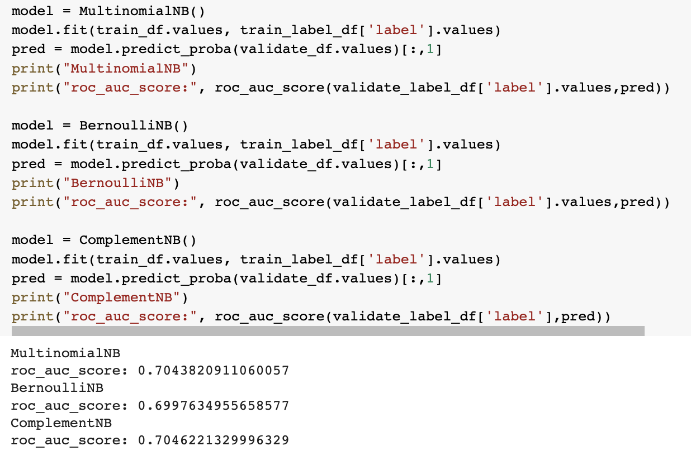
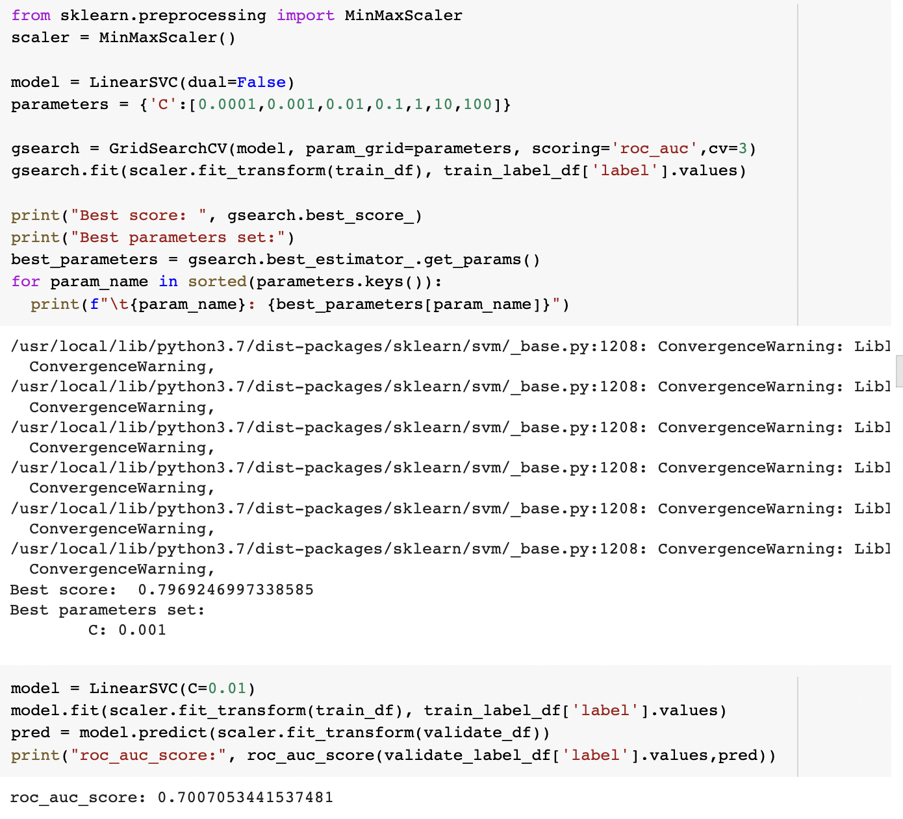
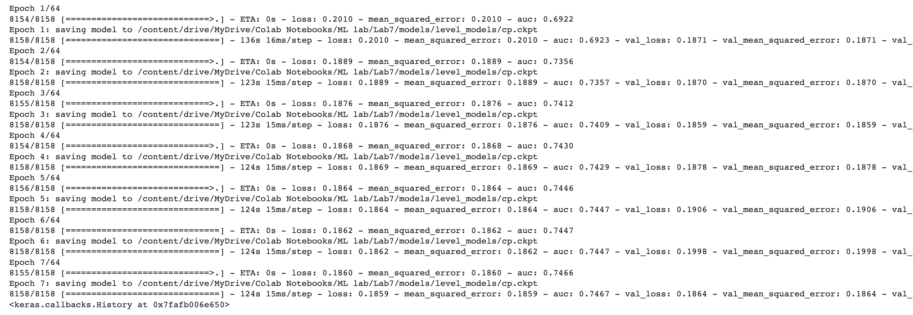
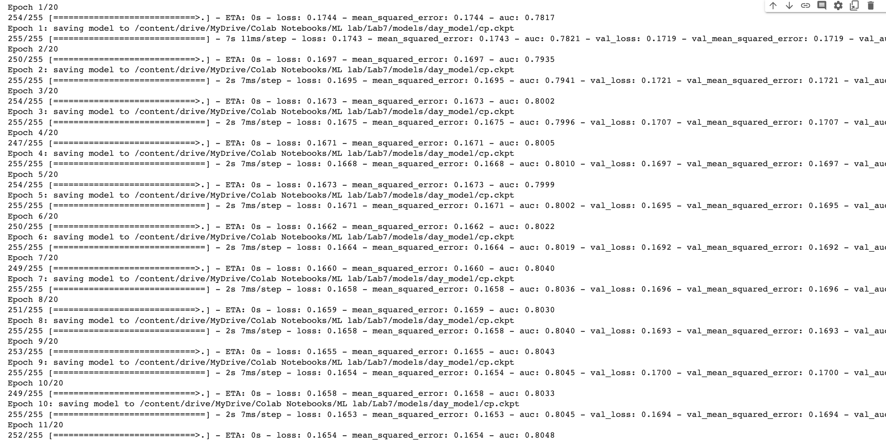
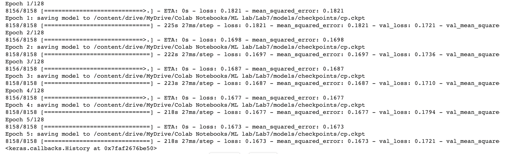
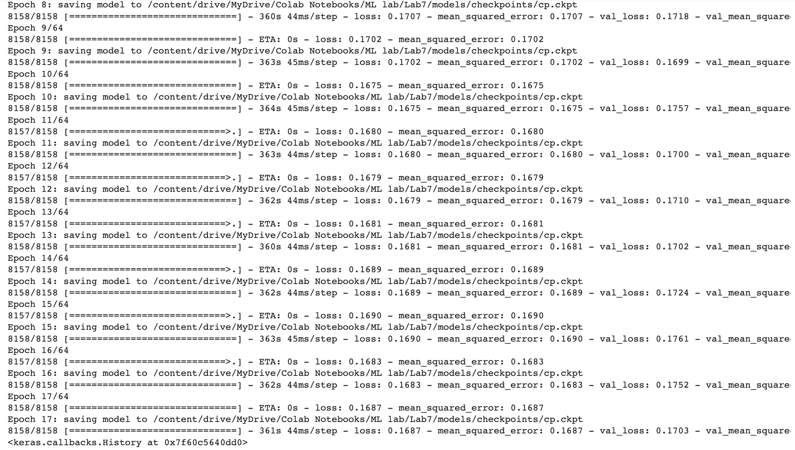
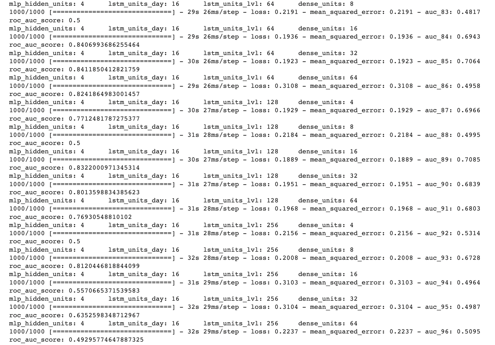
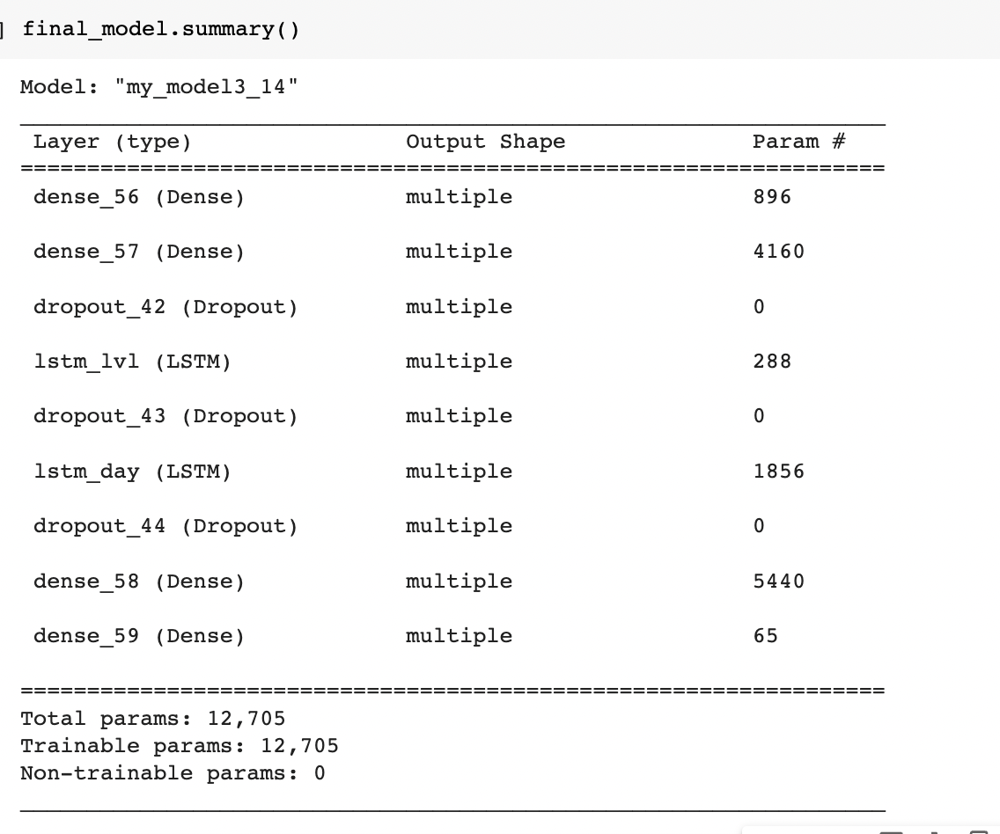

# 实验七报告

## 一. 案例简介

手游在当下的日常娱乐中占据着主导性地位，成为人们生活中放松身心的一种有效途径。近年来，各种类型的手游，尤其是闯关类的休闲手游，由于其对碎片化时间的利用取得了非常广泛的市场。然而在此类手游中，新用户流失是一个非常严峻的问题，有相当多的新用户在短暂尝试后会选择放弃，而如果能在用户还没有完全卸载游戏的时候针对流失可能性较大的用户施以干预（例如奖励道具、暖心短信），就可能挽回用户从而提升游戏的活跃度和公司的潜在收益，因此用户的流失预测成为一个重要且挑战性的问题。在毕业项目中我们将从真实游戏中非结构化的日志数据出发，构建用户流失预测模型，综合已有知识设计适合的算法解决实际问题。

## 二. 实验要求

- 根据给出的实际数据（包括用户游玩历史，关卡特征等），预测测试集中的用户是否为流失用户（二分类）；
- 一个基本的思路可以是：根据游玩关卡的记录为每个用户提取特征 → 结合 label 构建表格式的数据集 → 使用不同模型训练与测试；
- 方法不限，评价指标使用 AUC；
- 提交代码与实验报告，报告展示对数据的观察、分析、最后的解决方案以及不同尝试的对比等；

## 三. 原始数据概览

本次使用的是一个休闲类闯关手游的数据，用户在游戏中不断闯关，每一关的基本任务是在限定步数内达到某个目标。每次闯关可能成功也可能失败，一般情况下用户只在完成一关后进入下一关，闯关过程中可以使用道具或提示等帮助。

对大多数手游来说，用户流失往往发生在早期，因此次周的留存情况是公司关注的一个重点。本次数据选取了 2020.2.1 注册的所有用户在 2.1-2.4 的交互数据，数据经过筛选保证这些注册用户在前四日至少有两日登录。流失的定义则参照次周（2.7-2.13）的登录情况，如果没有登录为流失。

本次的数据和以往结构化的形式不同，展现的是更原始的数据记录，更接近公司实际日志的形式，共包含 5 个文件：

1. train.csv: 训练集用户，包括用户 id（从 1 开始）以及对应是否为流失用户的 label（1：流失，0：留存）。

   

   训练集共 8158 个用户，其中流失用户大约占 1/3，需要注意的是为了匿名化，这里数据都经过一定的非均匀抽样处理，流失率并不反映实际游戏的情况，用户与关卡的 id 同样经过了重编号，但对于流失预测任务来说并没有影响。

2. dev.csv: 验证集格式和训练集相同，主要为了方便离线测试与模型选择。

   

3. test.csv: 测试集只包含用户 id，任务就是要预测这些用户的流失概率。

   

4. level_seq.csv: 

   这个是核心的数据文件，包含用户游玩每个关卡的记录，每一条记录是对某个关卡的一次尝试，具体每列的含义如下：

   - `user_id`：用户 id，和训练、验证、测试集中的可以匹配；
   - `level_id`：关卡 id；
   - `f_success`：是否通关（1：通关，0：失败）；
   - `f_duration`：此次尝试所用的时间（单位 s）；
   - `f_reststep`：剩余步数与限定步数之比（失败为 0）；
   - `f_help`：是否使用了道具、提示等额外帮助（1：使用，0：未使用）；
   - `time`：时间戳。

   

5. level_meta.csv: 

   每个关卡的一些统计特征，可用于表示关卡，具体每列的含义如下：

   * `f_avg_duration`：平均每次尝试花费的时间（单位 s，包含成功与失败的尝试）；
   * `f_avg_passrate`：平均通关率；
   * `f_avg_win_duration`：平均每次通关花费的时间（单位 s，只包含通关的尝试）；
   * `f_avg_retrytimes`：平均重试次数（第二次玩同一关算第 1 次重试）；
   * `level_id`：关卡 id，可以和 level_seq.csv 中的关卡匹配。


## 四. 特征提取

由于想要尝试使用循环神经网络，循环神经网络的特点便是输入数据都是序列化的，因此这里考虑了三种不同的特征提取方式：1. 总体特征: `general features`（无序）；2. 单天特征: `day features（有序）` ；3. 关卡特征: `level features`（有序）。 以下是对特征具体描述。

| 总体特征 | 命名                     | 描述                                               |
| -------- | :----------------------- | :------------------------------------------------- |
| 1.       | `last day`               | 用户最后一天在线的时间                             |
| 2.       | `rounds`                 | 用户总共在线的次数                                 |
| 3.       | `num_of_days`            | 用户一共玩了几天                                   |
| 4.       | `highest_level_attained` | 用户达到的最高关卡（无论pass或fail）               |
| 5.       | `highest_level_passed`   | 用户通过的最高关卡                                 |
| 6.       | `total_duration`         | 用户一共在线的时长                                 |
| 7.       | `avg_duration`           | 用户每次在线的平均时长                             |
| 8.       | `succ_duration_ratio`    | 用户顺利通过的所有关卡所用的总时长                 |
| 9.       | `mean_reststep`          | 用户每个关卡的平均剩余步数（无论pass或fail）       |
| 10.      | `succ_mean_reststep`     | 用户每个通过的关卡的平均剩余步数                   |
| 11.      | `total_help`             | 用户总共求助次数                                   |
| 12.      | `succ_help_ratio`        | 用户所有通过的关卡使用的求助次数与总求助次数的比值 |
| 13.      | `passrate`               | 用户通过的次数与总共尝试次数的比值                 |

| 单天特征 | 命名                  | 描述                                               |
| -------- | --------------------- | -------------------------------------------------- |
| 1.       | `num_of_rounds`       | 用户单天一共在线次数                               |
| 2.       | `tot_duration`        | 用户单天一共在线时长                               |
| 3.       | `num_of_helps`        | 用户单天使用的求助次数                             |
| 4.       | `sep_time`            | 用户单天第一次登录和最后一次登录之间的间隔时间长度 |
| 5.       | `num_of_success`      | 用户单天成功通关的次数                             |
| 6.       | `succ_duration_ratio` | 用户单天成功通关的总时长                           |
| 7.       | `latest_level`        | 用户单天之后达到的最高关卡                         |
| 8.       | `latest_attempts`     | 用户单天达到最高关卡所尝试的次数                   |
| 9.       | `maximum attempts`    | 用户单天单个关卡所尝试的最多次数                   |
| 10.      | `passrate`            | 用户单天通过率：通关次数与尝试次数的比值           |
| 11.      | `num_of_levels`       | 用户单天玩了几个关卡                               |
| 12.      | `was_active_prev_day` | 用户前一天是否也在线                               |

| 关卡特征 | 命名                     | 描述                                                         |
| -------- | ------------------------ | ------------------------------------------------------------ |
| 1.       | `restrytimes`            | 用户当前关卡重复尝试次数                                     |
| 2.       | `win_retrytimes`         | 用户当前成功通关当前关卡所重新尝试的次数                     |
| 3.       | `passrate_ratio`         | 用户当前关卡通过率：当前关卡通过次数与总共尝试次数的比值     |
| 4.       | `is_success`             | 用户当前关卡是否通关                                         |
| 5.       | `help_count`             | 用户当前关卡所使用的求助次数                                 |
| 6.       | `succ_help_count`        | 用户当前关卡通关了的求助次数                                 |
| 7.       | `avg_reststep`           | 用户当前关卡平均剩余步数                                     |
| 8.       | `succ_reststep`          | 用户当前通关了的剩余步数                                     |
| 9.       | `avg_reststep_w/o_help`  | 用户当前关卡没有使用求助时的剩余步数                         |
| 10.      | `tot_duration`           | 用户当前关卡总共花的时长                                     |
| 11.      | `win_duration`           | 用户通关总共花的时长                                         |
| 12.      | `win_duration_ratio`     | 用户通过当前关所花的总时长与本关卡平均每次通关花费的时间（meta）的比值 |
| 13.      | `avg_duration_per_round` | 用户本次关卡所用的平均时长                                   |

以下是主要的特征提取代码:

*	总体特征提取和单天特征提取

```python
def extract_features_byDay(seq_df, df):
  for id in user_ids:
    # obtain individual user dataframe from seq_df
    id_df = seq_df.loc[seq_df['user_id'] == id]
    success_df = id_df[id_df['f_success'] == 1]
    # extract the general features
    days = np.array(id_df['day'])
    df.loc[id,'last_day'] = days.max()
    df.loc[id,'rounds'] = id_df.shape[0]
    days = set(days)
    df.loc[id,'num_of_days'] = len(days)
    df.loc[id,'highest_level_attained'] = id_df['level_id'].max()
    if not success_df.empty: df.loc[id,'highest_level_passed'] = success_df['level_id'].max()
    df.loc[id,'total_duration'] = id_df['f_duration'].sum()
    df.loc[id,'avg_duration'] = (id_df['f_duration'].sum())/(id_df.shape[0])
    if not success_df.empty: df.loc[id,'succ_duration_ratio'] = success_df['f_duration'].sum()/id_df['f_duration'].sum()
    df.loc[id,'mean_reststep'] = id_df['f_reststep'].mean()
    if not success_df.empty: df.loc[id,'succ_mean_reststep'] = success_df['f_reststep'].mean()
    df.loc[id,'total_help'] = id_df['f_help'].sum()
    if not success_df.empty and id_df['f_help'].sum(): df.loc[id, 'succ_help_ratio'] = success_df['f_help'].sum()/id_df['f_help'].sum()
    df.loc[id,'passrate'] = id_df['f_success'].sum()/id_df.shape[0]
    
    # compute day-specific features
    for day in days:
      day_df = id_df.loc[id_df['day'] == day]
      # compute number of rounds on that day
      rounds = day_df['time'].shape[0]
      df.loc[id,str(day)+' num_of_rounds'] = rounds
      # compute total duration on that day
      duration = day_df['f_duration'].sum()
      df.loc[id,str(day)+' tot_duraiton'] = duration
      # compute total helps called on that day
      helps = day_df['f_help'].sum()
      df.loc[id,str(day)+' num_of_helps']=helps 
      # separation time between the first the last round on that day
      separation_time=day_df['time'].max()-day_df['time'].min()
      df.loc[id,str(day)+' sep_time'] = separation_time.seconds
      # count the number of successful rounds on that day
      num_of_success = day_df['f_success'].sum()
      df.loc[id,str(day)+' num_of_success'] = num_of_success
      # success duration ratio
      t_df = day_df.loc[day_df['f_success'] == 1]['f_duration']
      df.loc[id,str(day)+' succ_duration_ratio'] = t_df.sum()/duration
      # compute the latest level reached on that day
      latest_level = day_df['level_id'].max()
      df.loc[id,str(day)+' lastest_level'] = latest_level
      # compute number rounds played on the latest level
      latest_attempts = day_df.loc[day_df['level_id'] == latest_level].shape[0]
      df.loc[id,str(day)+' latest_attempts'] = latest_attempts
      
      levels = set(day_df['level_id'])
      attempts_per_lvl = []
      for lvl in levels:
        lvl_df = day_df.loc[day_df['level_id'] == lvl]
        attempts_per_lvl.append(lvl_df.shape[0]-lvl_df['f_success'].sum())
        passrate = lvl_df['f_success'].sum()/lvl_df.shape[0]
      
      # maximum attempts 
      df.loc[id,str(day)+' maximum attempts'] = max(attempts_per_lvl)
      # passrate on the day
      df.loc[id,str(day)+' passrate'] = passrate
      # count the number of levels played on the day
      df.loc[id,str(day)+' num_of_levels'] = len(levels)
      # check if the user is also active on the previous day
      prev_day = day-1
      if prev_day in days:
        df.loc[id,str(day)+' was_active_prev_day'] = 1
      else:  df.loc[id,str(day)+' was_active_prev_day'] = 0

```

* 关卡特征提取

```python

def extract_features_byLevel(seq_df, meta_df, df):
  # obtain individual user dataframe from seq_df
  for id in user_ids:
    id_df = seq_df.loc[seq_df['user_id'] == id]
    for lvl in level_ids:
      # obtain the individual level dataframe
      lvl_df = id_df.loc[id_df['level_id'] == lvl]
      success_df = lvl_df.loc[lvl_df['f_success']==1]
      no_help_df = lvl_df.loc[lvl_df['f_help']==0]
      if not lvl_df.empty:
        df.loc[id,str(lvl)+'_retrytimes'] = lvl_df.shape[0]-1
        df.loc[id,str(lvl)+'_is_success'] = lvl_df['f_success'].max()
        df.loc[id,str(lvl)+'_help_count'] = lvl_df['f_help'].sum()
        df.loc[id,str(lvl)+'_avg_reststep'] = lvl_df['f_reststep'].mean()
        df.loc[id,str(lvl)+'_tot_duration'] = lvl_df['f_duration'].sum()
        df.loc[id,str(lvl)+'_avg_duration_per_round'] = lvl_df['f_duration'].mean()
        if not no_help_df['f_help'].empty: df.loc[id,str(lvl)+'_avg_reststep_w/o_help'] = no_help_df['f_reststep'].mean()
        else: df.loc[id,str(lvl)+'_avg_reststep_w/o_help'] = 0
        if not success_df.empty: 
          df.loc[id,str(lvl)+'_passrate_ratio'] = (success_df.shape[0]/lvl_df.shape[0])/(meta_df.loc[meta_df['level_id']==lvl]['f_avg_passrate'].values)
          df.loc[id,str(lvl)+'_win_retrytimes'] = lvl_df.shape[0]-1
          df.loc[id,str(lvl)+'_succ_help_count'] = success_df['f_help'].sum()
          df.loc[id,str(lvl)+'_succ_reststep'] = success_df['f_reststep'].mean()
          df.loc[id,str(lvl)+'_win_duration'] = success_df['f_duration'].mean()
          df.loc[id,str(lvl)+'_win_duration_ratio'] = success_df['f_duration'].mean()/(meta_df.loc[meta_df['level_id']==lvl]['f_avg_win_duration'].values)
        else:
          df.loc[id,str(lvl)+'_passrate_ratio'] = 0
          df.loc[id,str(lvl)+'_win_retrytimes'] = 0
          df.loc[id,str(lvl)+'_succ_help_count'] = 0
          df.loc[id,str(lvl)+'_succ_reststep'] = 0
          df.loc[id,str(lvl)+'_win_duration'] = 0
          df.loc[id,str(lvl)+'_win_duration_ratio'] = 0   
          
```


## 五. 特征处理

### 5.1 观察特征

下图是部分特征的截取。其实有些特征的相关性还是较大的，可以忽略或只用PCA降维。这里并没有做这样的处理的主要原因是本次使用的模型对于特征是否相关的影响不是很大（个人理解，可能有误）。


### 5.2 特征离散化

这里特征离散化的主要目的是为了之后决策树的训练。


### 5.2 特征归一化

特征归一化是必要的。无论是传统模型中的SVM还是神经网络，都有梯度下降的计算。归一可以使得梯度下降的更稳定。这里特征归一化使用的是MinMaxScaler。

## 六. 传统模型构建

这里简单地测试了一些基本分类模型。

### 6.1 决策树

以下是经过GridSearchCV调整参数后，所获得的较优决策树。


下图是决策树的绘图。

可以看到单天特征占了总共所有决策树特征中的$5/6$，约83.3%。主要有：

1. `4 latest_level` : 玩家最后一天的最后所通关的关卡;
1. `3 num_of_levels` : 玩家第三天的通关数；
1. `4 sep_time` : 玩家最后一天第一次在线和最后一次在线的时间间隔；
1.  `4 num_of_rounds` : 玩家最后一天打关卡的次数；
1. `3 maximum attempts`:玩家第三天的最高尝试次数。
1. `total_duration `: 玩家总共玩的时长。


分析：由此可见，其实对于玩家在下一个时间间隔是否留存这个问题来说，其主要的因素是玩家最后几天玩游戏的因素所主导的（这也很符合现实情况）。而我提取关卡特征的主要原因在于对于游戏开发商而言，玩家每天在线状况是不可控的，唯一可控的是游戏体验，在本案例中便是游戏关卡的难度。如果游戏开发商可以从模型训练中获取相关信息，对他们提升游戏体验可能更有帮助。

### 6.2 贝叶斯分类器

简单地测试了以下贝叶斯分类器。可以看到贝叶斯分类器并不适合本案例的情况。



### 6.3 SVM



SVM在本案例中效果不是很好，个人认为这主要是因为我把序列话的数据当做无序的独立的特征维度简单地喂给了SVM，因此效果不佳。

### 6.4 模型集成 XGBoost

查看资料的时候看到是可以用这个模型来进行time series prediction，于是在这个部分尝试使用一下。

```python
from xgboost import XGBClassifier

model = XGBClassifier(
    n_estimators = 80,
    max_depth = 3,
    learning_rate = 0.1
)
```

效果：

虽然论文说是以每次新构造一棵树为迭代步长再结合loss function的gradient来减少误差，不过至于为什么可以用来做time series prediction，任然不太明白。但至少就其在本案例中的表现来说，是很不错的了。


## 七. 神经网络模型构建

### 7.1 多层感知机 (MLP)

这里多层感知机使用的`sklearn`库中的`MLPClassifier`模型仅对总体特征（general features）进行训练。

总体效果在 [0.70, 0.71] 之间 。

### 7.2 循环神经网络 (RNN)

对与关卡特征的lstm，由于每个玩家所通过的关卡不同，因此`lstm`的`seqence length`是有变化的，也给模型的训练带来了一定难度。这里存在两种解决方案: 1. padding补齐所有缺失的`NaN`值， 以便分batch输入； 2. 自定义一个data loader/data generator 使得每次可以只是用一个样本来训练模型。

这里我先尝试了pad 0补齐，模型效果并没有预想中的那么好。其主要原因是在与这个padding的值对于模型来说是一个人为的噪音，影响了模型的训练。因此后来采用了单个样本输入训练的方法。而这样的输入是需要自定义一个data generator的。以下是其定义：

```python
# Batch Generator class for generating sequences with batch_size = 1
# Each user would have completed different number of levels, which means the sequence length is varying between users
# => Cannot pass in batch by batch

class MyBatchGenerator(Sequence):
  def __init__(self, X, y, batch_size=1, shuffle=True):
    self.X = X
    self.y = y
    self.batch_size = batch_size
    self.shuffle = shuffle
    self.on_epoch_end()

  def __len__(self):
    # Denotes the number of batches per epoch
    return int(np.floor(len(self.y)/self.batch_size))
  
  def __getitem__(self, index):
    return self.__data_generation(index)
  
  def on_epoch_end(self):
    # Shuffles indexes after each epoch
    self.indexes = np.arange(len(self.y))
    if self.shuffle == True:
      np.random.shuffle(self.indexes)

  def __data_generation(self, index):
    # * unpacks a list or tuple into position arguments
    Xb = np.empty((self.batch_size, *self.X[index].to_tensor().shape))
    yb = np.empty((self.batch_size, *self.y[index].shape))
    # naively use the same sample over and over again
    for s in range(0, self.batch_size):
      Xb[s] = self.X[index].to_tensor()
      yb[s] = self.y[index]
    return Xb, yb
```


#### 7.2.1 对于关卡特征的LSTM 

```python
# Batch size = 1

n_level_features = 13

model1 = Sequential(name="level_model")
model1.add(LSTM(lstm_units, input_shape=(None, n_level_features)))
model1.add(Dense(1, activation='sigmoid'))

model1.compile(loss=tf.losses.MeanSquaredError(),
              optimizer=tf.optimizers.Adam(learning_rate=0.01),
              metrics=[tf.keras.metrics.MeanSquaredError(),
                       tf.keras.metrics.AUC()])
print(model1.summary())
```

model summary：

训练结果：

单个Level LSTM的效果不如单个Day LSTM。

#### 7.2.2 对于单天特征的LSTM

```python
n_features_day = 12

model2 = Sequential(name="day_model")
model2.add(LSTM(lstm_units, input_shape=(seq_len, n_features_day)))
model2.add(Dense(1, activation='sigmoid'))


model2.compile(loss=tf.losses.MeanSquaredError(),
              optimizer=tf.optimizers.Adam(learning_rate=0.01),
              metrics=[tf.keras.metrics.MeanSquaredError(),
                       tf.keras.metrics.AUC()])
print(model2.summary())
```

model summary：

训练结果：

其实单个Day LSTM的效果已经很不错了。

### 7.3 多个神经网络拼接

这个章节尝试了将上述提到的 `mlp,` `lstm_level`, `lstm_day上述的三个神经网络结合起来，看看效果如何。

#### 7.3.1 Level LSTM + Day LSTM

```python
n_level_features = 13
n_day_features = 12

class MyModel(Model):

  def __init__(self):
    super().__init__()
    self.lstm_lvl = LSTM(128, input_shape=(None, n_level_features), name="lstm_lvl", dtype = 'float64')
    self.lstm_day = LSTM(128, input_shape=(None, n_day_features), name="lstm_day", dtype = 'float64')
    self.dense2 = Dense(1, activation='sigmoid')
  
  # forward pass
  def call(self, inputs):
    input1, input2 = inputs
    lvl_output = self.lstm_lvl(input1)
    day_output = self.lstm_day(input2)
    out1 = tf.keras.layers.concatenate([lvl_output, day_output],axis=1)
    return self.dense2(out1)

```

训练结果: 

#### 7.3.2 General MLP + Level LSTM + Day LSTM

```python
# Model Definition
n_level_features = 13
n_day_features = 12
n_general_features = 13

class MyModel2(Model):

  def __init__(self):
    super().__init__()
    self.mlp_hidden_1 = Dense(128, activation = 'relu', input_dim = n_general_features)
    self.mlp_hidden_2 = Dense(64, activation = 'relu')
    self.lstm_lvl = LSTM(lstm_units, input_shape=(None, n_level_features), name="lstm_lvl", dtype = 'float64')
    self.lstm_day = LSTM(lstm_units, input_shape=(None, n_day_features), name="lstm_day", dtype = 'float64')
    self.dense1 = Dense(32, activation='relu')
    self.dense2 = Dense(1, input_shape=(None, 32), activation='sigmoid')
  
  # forward pass
  def call(self, inputs):
    input_general, input_lvl, input_day = inputs
    general_output1 = self.mlp_hidden_1(input_general)
    general_output2 = self.mlp_hidden_2(general_output1)
    lvl_output = self.lstm_lvl(input_lvl)
    day_output = self.lstm_day(input_day)
    concat = tf.keras.layers.concatenate([general_output2, lvl_output, day_output],axis=1)
    out = self.dense1(concat)
    return self.dense2(out)

```

model summary： 

训练结果：

### 7.4 模型调优

#### 7.4.1 超参调整

经过简单的（暴力）打点取值调整四个参数：`mlp_hidden_units`, `lstm_units_day`, `lstm_units_lvl`, `dense_units`

```python
# 取值范围
parameters = {
    'mlp_hidden_units': [4,8,16,32,64,128],
    'lstm_units_day': [4,8,16,32,64,128],
    'lstm_units_lvl': [8,16,32,64,128,256],
    'dense_units':[4,8,16,32,64]
}
# epochs = 1
# batch_size = 1
```

* 下图是在不同参数组合下训练结果的部分截取：



分析：对比可以看出当`mlp_hidden_units`，`lstm_units_day`及`dense_units`的相比于`lstm_units_lvl`较小时，效果更佳。个人认为这可能与总体，单天，关卡这三个特征的序列的长度（sequence length）有关。具体原因还需深入研究（以上仅个人观点，有可能有误）。

#### 7.4.2 正则化

在单个模型结果输出之后加了一层`Dropout layer` ，舍弃百分之二十的输出。防止过拟合。

```python
# add dropout layer

mlp_hidden_units = 64
lstm_units_lvl = 4
lstm_units_day = 16
dense_units = 64
n_level_features = 13
n_day_features = 12
n_general_features = 13

class MyModel3(Model):

  def __init__(self):
    super().__init__()
    # mlp
    self.mlp_hidden_1 = Dense(mlp_hidden_units, activation = 'relu', input_dim = n_general_features)
    self.mlp_hidden_2 = Dense(mlp_hidden_units, activation = 'relu')
    self.drop1 = Dropout(0.2, input_shape=(None, mlp_hidden_units))
    # lstm
    self.lstm_lvl = LSTM(lstm_units_lvl, input_shape=(None, n_level_features), name="lstm_lvl", dtype = 'float64')
    self.drop2 = Dropout(0.2, input_shape=(None, lstm_units_lvl))
    self.lstm_day = LSTM(lstm_units_day, input_shape=(None, n_day_features), name="lstm_day", dtype = 'float64')
    self.drop3 = Dropout(0.2, input_shape=(None, lstm_units_day))
    # combine
    self.dense1 = Dense(dense_units, activation='relu')
    self.dense2 = Dense(1, input_shape=(None, dense_units), activation='sigmoid')
  
  # forward pass
  def call(self, inputs):
    input_general, input_lvl, input_day = inputs

    general_output1 = self.mlp_hidden_1(input_general)
    general_output2 = self.mlp_hidden_2(general_output1)
    general_output3 = self.drop1(general_output2)

    lvl_output1 = self.lstm_lvl(input_lvl)
    lvl_output2 = self.drop2(lvl_output1)

    day_output1 = self.lstm_day(input_day)
    day_output2 = self.drop3(day_output1)

    concat = tf.keras.layers.concatenate([general_output3, lvl_output2, day_output2],axis=1)
    out = self.dense1(concat)
    return self.dense2(out)

```

model summary:

训练结果：

分析：经过各种调整后，模型的`loss`维持在$0.16$~$0.17$之间， 相对稳定，感觉这已经是这个模型的极限了。`loss` 过小会存在严重的过拟合， 在本案例中`loss`$\leq 0.16$，就可以算是过拟合了。

## 八. 总结 

最终模型采用了 `mlp_hidden_units = 64`，`lstm_units_lvl = 4`, `lstm_units_day = 16`, `dense_units = 64` 这样的配置组合， 此外`epochs = 13` ， `learning_rate = 0.05`   

总体来说效果没有特别理想（期望值是0.8的）， 有可能是我建模的问题，不过是一次很好的体验。


