# 实验四报告

## 一. 实验目的

图像的智能处理一直是人工智能领域广受关注的一类技术，代表性的如人脸识别与 CT 肿瘤识别，在人工智能落地的进程中发挥着重要作用。其中车牌号识别作为一个早期应用场景，已经融入日常生活中，为我们提供了诸多便利，在各地的停车场和出入口都能看到它的身影。车牌号识别往往分为字符划分和字符识别两个子任务，本案例我们将关注字符识别的任务，尝试用 K-NN 的方法对分割好的字符图像进行自动识别和转化。

- 完成数据的读入和表示，将图片表示成向量并和 label 对应上；
- 构建 K-NN 模型（可调库）对测试集中的图片进行预测并计算准确率；
- 分析当 K 取不同值时测试准确率的变化。
- 分析不同距离度量方式对模型效果的影响；
- 对比平权和加权 K-NN 的效果；
- 分析训练集大小对测试结果的影响。


## 二. 数据概览

本次我们使用已经分割好的车牌图片作为数据集，包括数字 0-9、字母 A-Z（不包含 O 和 I）以及省份简称共 65 个类，编号从 0 到 64。数据已经分成了训练集和测试集，里面的文件夹用 label 编号命名，一个文件夹下的所有图片都属于该文件夹对应的类，每个图片都是 20 * 20 的二值化灰度图。

```python
from PIL import Image
img = Image.open('data/train/0/4-3.jpg')  # 打开图片
img  # 显示图片from PIL import Image
```

```python
import numpy as np
pixels = np.array(img)  # 转化为 numpy 矩阵
pixels.shape
```

### 2.1 读取数据

这里将`x_train`, `y_train`, `x_test` 及 `y_test` 转换成了`numpy array`, 方便以后使用

``` python
import os
from PIL import Image
import numpy as np

train_data_path = '/content/drive/MyDrive/Colab Notebooks/ML lab/Lab4/data/train'
folders = os.listdir(train_data_path)
folders.sort(key=int)
x_train = []
y_train = []
category_count = [0]*65
for folder in folders:
  subpath = train_data_path +'/'+folder
  files = os.listdir(subpath)
  for file in files:
    filepath = subpath + '/' + file
    img = Image.open(filepath)  
    # transform the image to matrix
    pixels = np.array(img)
    x_train.append(pixels)
    y_train.append(int(folder))
    category_count[int(folder)]+=1


x_train = np.array(x_train)
nsamples, nrows, ncols = x_train.shape
x_train = x_train.reshape((nsamples, nrows*ncols))
print(x_train.shape)
```

测试集一共有15954个数据，训练集一共有4665个数据


## 三. 模型建立

### 3.1 使用sklearn库的`KNeighborsClassifier`

```python
from sklearn.metrics import accuracy_score
from sklearn.neighbors import KNeighborsClassifier

knn = KNeighborsClassifier(algorithm='kd_tree', n_neighbors = 3)
knn.fit(x_train, y_train)
p_test = knn.predict(x_test)
print(accuracy_score(y_test, p_test))
```

*	结果：accuracy_score = $0.69989281886388$ 

### 3.2 使用sklearn库的`KDTree`模型

`KDTree`是一种可以加速knn模型对最近邻居选择/计算的数据存储和查询结构

此次实验由于时间关系并没有尝试手写`KDTree`， 仅在sklearn的`KDTree`上做了个简单的封装

```python
import numpy as np
from sklearn.neighbors import KDTree

class KNNClassifier(object):
  def __init__(self, n_neighbors = 3):
    self._kdtree = None
    self._labels = None
    self._n_neigbors = n_neighbors

  def fit(self, X, y):
    self._kdtree = KDTree(X)
    self._labels = np.array(y)

  def predict(self, X):
      dist, indices = self._kdtree.query(X, k = self._n_neigbors)
      pred = []
      for ind in indices: 
        votes = self._labels[ind]
        p = self._mod(votes)
        pred.append(p)
      return pred

  def _mod(self, y):
    if len(y)==1: return y[0]
    map = [0]*65
    for label in y:
      map[label]+=1
      # if this label has vote count exceeds half of the total number of votes, directly return this category
      if map[label] >=(len(y)+1)/2: return label

    return map.index(max(map))

```

```python
# test the model
knn2 = KNNClassifier()
knn2.fit(x_train, y_train)
p_test2 = knn2.predict(x_test)
print("accuracy_score: ", accuracy_score(p_test2, y_test))
```

*  结果： accuracy_score 为 $0.69989281886388$， 可以看到其效果是与`KNeighborsClassifier`一致的。


## 四. 分析取不同的K值时测试准确率的变化

```python
# find out the variation of the accuracy scores against different value of k
k = []
acc_scores = []
for K in range(1,51):
  k.append(K)
  knn = KNeighborsClassifier(n_neighbors = K)
  knn.fit(x_train, y_train)
  p_test = knn.predict(x_test)
  acc = accuracy_score(y_test, p_test)
  print("K: {}, accuracy_score: {}".format(K, acc))
  acc_scores.append(acc)
```

* 效果：

  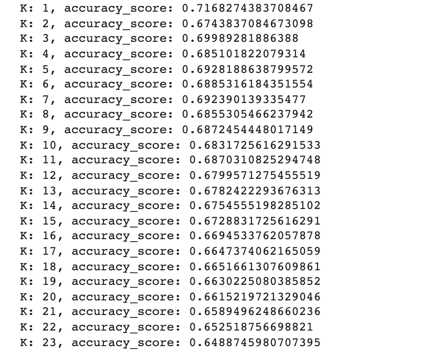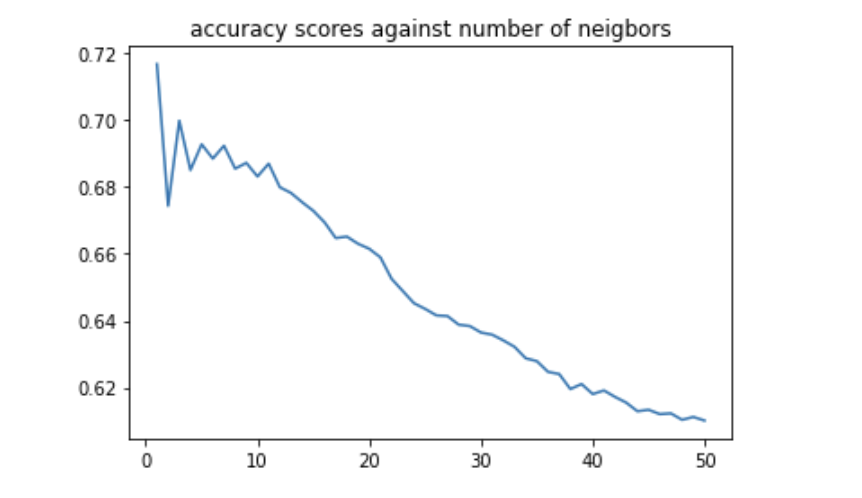

* 分析：从上图中可以看到随着k的取值增大， accuracy score逐渐下降， 主要是因为虽然较大的k会抑制噪声的影响，但会使分类边界不那么明显。


## 五. 分析不同距离度量方式对模型效果的影响

*	先来看一下sklearn是如何计算两个2x2的matrix之间的距离的：

```python
from sklearn.metrics.pairwise import euclidean_distances

X = [[[1,1],[1,1]],[[0,0],[0,0]]]
Y = [[[0,0],[0,0]]]
X = np.array(X)
nsamples, nrows, ncols = X.shape
X = X.reshape((nsamples, nrows*ncols))
print(X)
Y = np.array(Y)
nsamples, nrows, ncols = Y.shape
Y = Y.reshape((nsamples, nrows*ncols))
print(Y)
euclidean_distances(X,Y)
```

结果：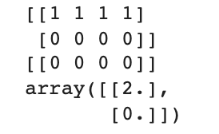

实际上我们将2x2matrix转化成一个1x4的vector之后，在未给distance函数，这里测试了`euclidean distance`函数，及norm定义式的p值取2时的计算方式， 可以看到当我们第一个vecotr X[0] = [1,1,1,1] 到原点[0,0,0,0]的距离确实是2.， 而第二个vector, X[1] = [0,0,0,0], 即原点本身到原点的距离为0.， 符合`euclidean distance`公式。

*	在测试之前查看了一下`KNeighborsClassifier`接受的距离度量方法，其中`'l2'==‘euclidean'`, `'minkowski' == 'p'`, `'manhattan' == 'cityblock' == 'l1'`, `'chebyshev' == 'infinity'`.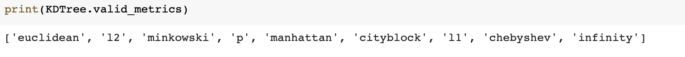

* 尝试使用不同的距离度量方式来构建模型，并计算对应的accuracy score

```python
acc_scores = []
distance_metrics = ['minkowski', 'euclidean', 'manhattan','chebyshev']
for metric in distance_metrics:
    knn = KNeighborsClassifier(n_neighbors = 3, algorithm = 'kd_tree', metric = metric)
    knn.fit(x_train, y_train)
    p_test = knn.predict(x_test)
    acc = accuracy_score(y_test, p_test)
    print(metric)
    print("accuracy_score:", acc)
    acc_scores.append(acc)

```

* 结果：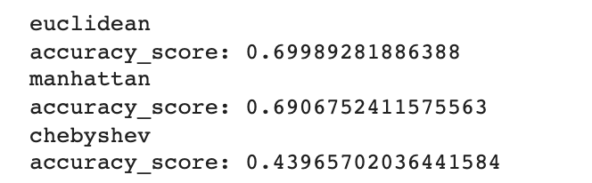

  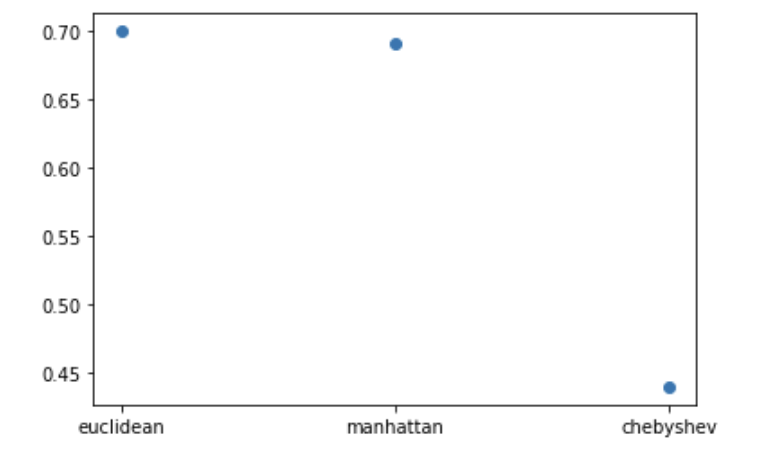

* 分析：上图可以看出，`euclidean` 的距离计算是三者中最佳的。**其原因还需多加研究**。


## 六. 对比平权和加权 K-NN 的效果 

*	尝试不同的权值计算方法：

```python
# weight functions
# 1/d^2
def square_inverse(distances):
  distances = np.array(distances)
  return 1/np.square(distances)

# e^(-d)
def negative_exponential(distances):
  distances = np.array(distances)
  return np.exp(np.negative(distances))

# e^(-(d/variance)^2)
def gaussian_exponential(distances):
  distances = np.array(distances)
  var = np.var(distances)
  return np.exp(np.negative(np.square(distances/var)))

kernel_functions = ['uniform', 'distance', square_inverse, negative_exponential, gaussian_exponential]
```

* 结果：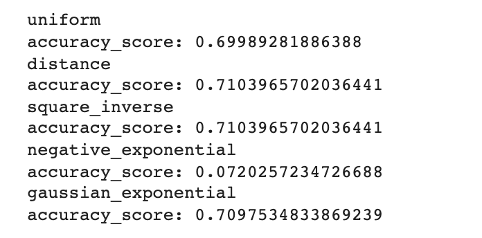

* 分析： 其中$\frac{1}{distance}$和 $\frac{1}{distance^2}$的权值计算方式没有区别, 如果将以上几个函数画一下，可以看出其中$\frac{1}{distance}$，$\frac{1}{distance^2}$, $e^{-(\frac{distance}{\sigma_0})^2}$这三个函数区别不是很大，而至于$e^{-distance}$函数为何给到的accuracy score这么低，不是很明白， 日后可以再做详细的探究

  

* 尝试不同的核宽度

```python
# different kernel width
def exponential_4(distances):
  distances = np.array(distances)
  return np.exp(np.negative(np.square(distances/4)))

def exponential_16(distances):
  distances = np.array(distances)
  return np.exp(np.negative(np.square(distances/16)))

def exponential_32(distances):
  distances = np.array(distances)
  return np.exp(np.negative(np.square(distances/32)))

def exponential_64(distances):
  distances = np.array(distances)
  return np.exp(np.negative(np.square(distances/64)))

def exponential_128(distances):
  distances = np.array(distances)
  return np.exp(np.negative(np.square(distances/128)))

def exponential_256(distances):
  distances = np.array(distances)
  return np.exp(np.negative(np.square(distances/256)))

def exponential_512(distances):
  distances = np.array(distances)
  return np.exp(np.negative(np.square(distances/512)))

def exponential_1024(distances):
  distances = np.array(distances)
  return np.exp(np.negative(np.square(distances/1024)))


kernel_width = [exponential_4, exponential_16, exponential_32, exponential_64, exponential_128, exponential_256, exponential_512, exponential_1024]
```

* 结果：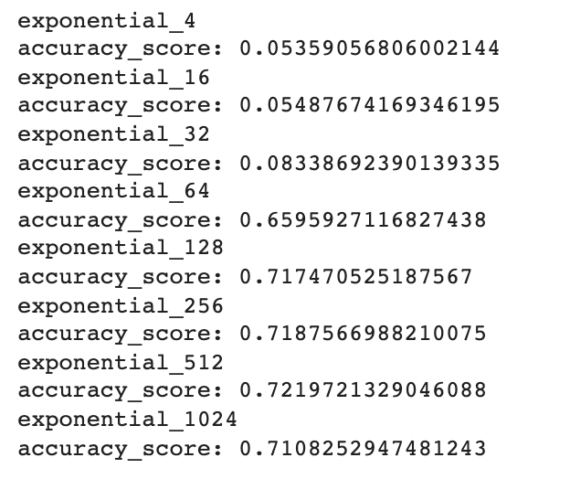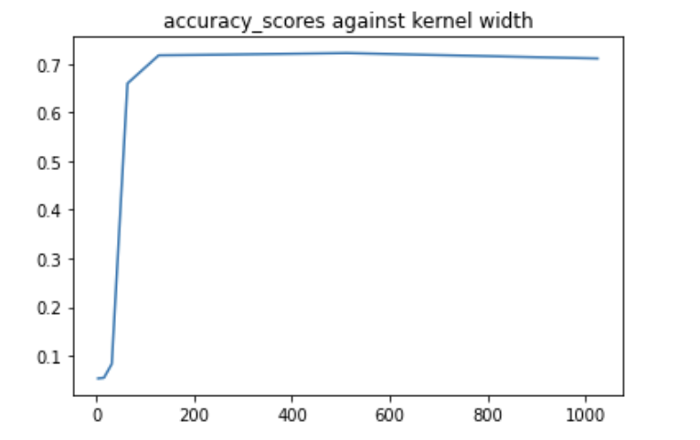

* 分析： 上图可以看出当核宽度在512附近时，accuracy score是最高的。$\sigma_0 \geq$ 512 时，整个kernel function看上去会跟一条水平直线差不多，即更多的更远的点较高的权重，这样其实与不给权重没有什么太大的差别。而$\sigma_0$较小时， 过于强调了较近的点而忽视了较远的点， 或者说区别对待了较远的点和较近的点。

  

## 七. 分析训练集大小对测试结果的影响

```python
# change the size of the training set
from sklearn.model_selection import train_test_split
MAX_SAMPLE_SIZE = 15954
RANDOM_SEED = 2022
train_sizes = [0.01, 0.02, 0.05, 0.07, 0.1, 0.2, 0.3, 0.4, 0.5, 0.6, 0.7, 0.8, 0.9, 0.99]
acc_scores3 = []
for train_size in train_sizes:
  x_train3, _, y_train3, _ = train_test_split(x_train, y_train, train_size = train_size, random_state = RANDOM_SEED)
  knn3 = KNeighborsClassifier(n_neighbors = 3, weights = 'distance', algorithm = 'kd_tree')
  knn3.fit(x_train3, y_train3)
  p_test3 = knn3.predict(x_test)
  acc = accuracy_score(y_test, p_test3)
  print("train size:", train_size*MAX_SAMPLE_SIZE, "accuracy_score:", acc)
  acc_scores3.append(acc)
```

* 结果：

  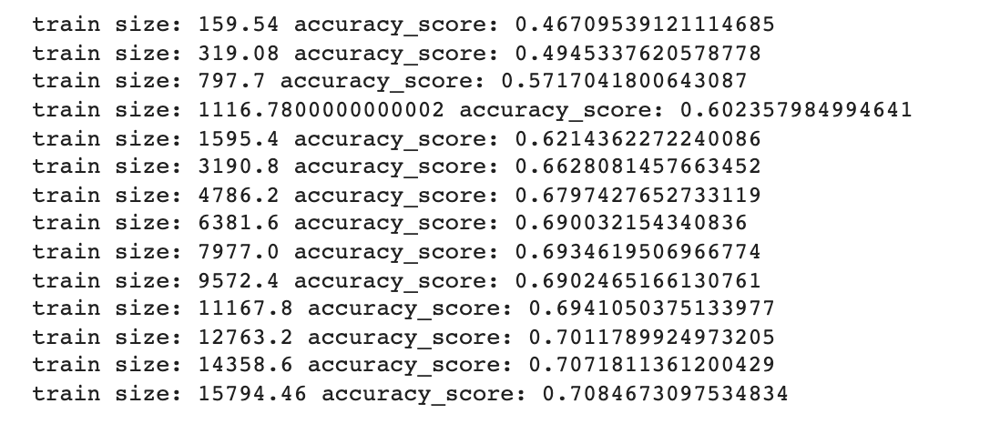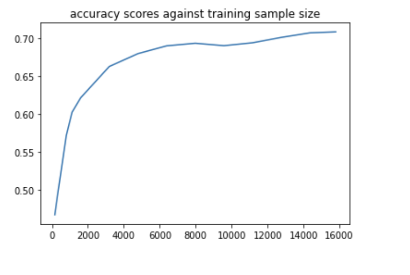

* 分析： 结果很显然， 越多的训练样本可以在模型计算prediction时有全面的参考。 当然，训练样例最好是均匀分布的，即每个分类中的样例个数相差不多，否则会有很大的bias。


## 八. 总结

本次实验学习了knn的主要原理以及其加速效率的存储与计算方式。

最终模型的采用了核宽度$\sigma_0 = 512$的距离加权函数, 距离计算公式为`euclidean distance`。

训练集一共有4665个数据，其unbiased estimate of sample standard deviation $\sigma_ \bar{x} \approx \sqrt{\frac{0.721972(1-0.721972)}{n}} =0.00655962$

A 95% confidence interval for accuracy score of this knn model  $\approx 0.721972 \pm 1.96 \cdot0.00655962 \approx 0.721972 \pm 0.012857 $


## 九. 图像表示以及其他算法的讨论

1. 二值 e.g. 过滤灰度值，只用黑白；
2. 尽量放大图像，占满整张画布；
3. 方向梯度直方图（HOG)；
4. 使用CNN

